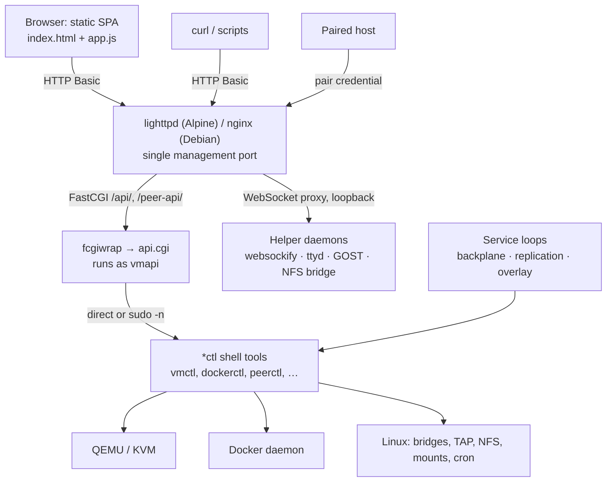

# Architecture

## Layers

1. **Static console** (`www/`): HTML, CSS and JavaScript with a vendored
   Bootstrap 5. No framework, no build. The browser holds no credentials; it
   relies on the browser's own HTTP Basic session.
2. **Web server**: authenticates every request, serves the static files,
   hands `/api/` and `/peer-api/` to FastCGI, and proxies WebSocket paths to
   loopback-only helper daemons.
3. **CGI router** (`cgi/api.cgi`, ~1,200 lines of Bash): parses the request,
   enforces capabilities, validates input and calls one command-line tool per
   operation. It contains no lifecycle logic of its own.
4. **Command-line tools** (`bin/*ctl`, sharing `lib/common.sh`): the actual
   implementation. Each is usable directly over SSH and is what the API calls.
5. **Native backends**: QEMU, Docker, the kernel.
6. **Service loops**: a few long-running Bash loops (supervised by OpenRC or
   systemd) that reconcile state: remounting peer storage, restarting
   replication mirrors, supervising overlay processes.

## Request path

A `POST /api/vms/web01/start` travels as follows:

1. lighttpd matches `^/api/`, requires a valid user from
   `/etc/lighttpd/vmapi.htpasswd`, and rewrites the path to
   `/api.cgi/vms/web01/start`.
2. `mod_fastcgi` passes it to `fcgiwrap` on `/run/fcgiwrap-vmapi.sock`, which
   executes `api.cgi` as the **`vmapi`** user.
3. `api.cgi` splits the route into `P=(vms web01 start)`, checks that the host
   has `qemu-kvm`, checks the method, and runs `vmctl start web01`.
4. `vmctl` reads `vm.conf`, builds the QEMU argument list, and starts QEMU
   daemonized with a pidfile and QMP/serial sockets under the VM's `runtime/`.
5. The router replies `{"state":"running","pid":1234}`.

If the command fails, `run_cmd` writes a `400` with the command's stderr as the
JSON `error`, on a preserved copy of the response stream (file descriptor 3),
so errors survive even when the handler discarded stdout. Managed commands do
not inherit that descriptor: daemonized QEMU would otherwise hold the FastCGI
response open.

### Why CGI

A process per request costs a few milliseconds of Bash start-up. In exchange
there is no resident application server, no memory growth, and a crash affects
only one request. `fcgiwrap` pre-forks a small pool (`-c 8`), so concurrency
is bounded and idle cost is a few MB.

## Privilege model

| Identity | Runs | Privilege |
|---|---|---|
| Web server user (`lighttpd` / `www-data`) | Web server | Reads static files and htpasswd files |
| **`vmapi`** | Every API request, VM QEMU processes started by the API, autostart | Unprivileged; member of `kvm` and (Docker profiles) `docker` |
| root | Service loops, privileged `*ctl` subcommands through `sudo -n` | Full |

Privileged operations (bridges, mounts, overlays, peer records, backups,
certificates, file browser, host terminal) go through **per-profile sudoers
rules** written by the installer to `/etc/sudoers.d/`. Rules name exact tools
and, where practical, exact subcommands (for example `overlayctl list`,
`overlayctl show *`). The router always uses `sudo -n`, so a missing rule fails
fast instead of prompting.

Two consequences:

- **Membership of the `docker` group is root-equivalent.** Anyone who can call
  the Docker endpoints is a host administrator, and the documentation treats
  them as one.
- The API must be able to **read** `/etc/vmapi/vmapi.conf` as `vmapi`. If
  `/etc/vmapi` becomes unreadable (mode `0750 root:root`), `common.sh` falls
  back to defaults silently and capabilities such as `storage-backplane`
  disappear. Tools must never re-mode `/etc/vmapi`; `peerctl` and
  `registryctl` create it only when missing.

## Profiles and capabilities

`VMAPI_PROFILE` in `vmapi.conf` records the installed profile. At runtime,
`vmapi_has_capability` in `lib/common.sh` decides each capability from what is
**actually available** (QEMU binary present, Docker daemon reachable,
`VMAPI_BACKPLANE_SERVER=true`). `api.cgi` gates whole route prefixes on those
capabilities and the console hides what is missing. The table is in the
[user guide](../user-guide/08-profiles-and-capabilities.md).

## Files and directories

| Path | Contents |
|---|---|
| `/etc/vmapi/vmapi.conf` | Host configuration, sourced by `common.sh` (must be readable by `vmapi`) |
| `/etc/vmapi/node-id` | 32-hex node ID (`0600`) |
| `/etc/vmapi/identity/ed25519.pem` / `.pub` | Node signing key pair (private key `0600`) |
| `/etc/vmapi/bridges/` | Persisted bridge definitions |
| `/etc/vmapi/overlays/` | Overlay definitions (`root:vmapi 0640`) |
| `/etc/vmapi/tls/` | Managed certificates, keys and CSRs |
| `/etc/vmapi/registry.conf` | OCI registry state (`0600`) |
| `/etc/vmapi-peer.htpasswd` | Pair credentials, generated from peer records |
| `/etc/lighttpd/vmapi.htpasswd` | Console users (Alpine) |
| `/etc/lighttpd/conf.d/zz-vmapi-*.conf` | Generated routes (overlays, registry) |
| `/var/lib/vmapi/vms/NAME/` | `vm.conf`, `nvram.fd`, `cloud-init/`, `runtime/` (pid, QMP and serial sockets) |
| `/var/lib/vmapi/disks/NAME/` | Disk images |
| `/var/lib/vmapi/isos/` | Installation media |
| `/var/lib/vmapi/backups/VM/` | Local backup archives |
| `/var/lib/vmapi/peers/` | Peer records `NODE_ID.conf` + `.pub`, pending pairing (`0700`) |
| `/var/lib/vmapi/backplane/` | Storage **served** to peers (server role) |
| `/var/lib/vmapi/peer-storage/NODE_ID/` | Peers' storage **mounted** here (client role) |
| `/var/lib/vmapi/compose/PROJECT/compose.yaml` | Compose projects |
| `/var/lib/vmapi/registry/` | OCI registry data |
| `/var/lib/vmapi/remote-container-layers/` | Writable layers of peer-backed containers |
| `/usr/local/bin/*ctl` | Command-line tools; `/usr/local/lib/vmapi/common.sh` |
| `/usr/lib/vmapi/cgi/` | `api.cgi`, `peer-api.cgi` |
| `/usr/share/vmapi/www/` | The console |

The three VM roots can be relocated (`storagectl relocate`); their current
values are `VM_ROOT`, `DISK_ROOT` and `ISO_ROOT` in `vmapi.conf`.

## Configuration

`/etc/vmapi/vmapi.conf` is a shell fragment. Notable keys:

| Key | Default | Meaning |
|---|---|---|
| `VMAPI_PROFILE` | set by installer | Installed profile |
| `VMAPI_HTTP_PORT` | `5186` | Management port |
| `VMAPI_TLS_ENABLED` / `VMAPI_TLS_MODE` | `false` / `none` | Managed by `certctl` |
| `VMAPI_BACKPLANE_SERVER` | `false` (installer enables it) | Serve storage to peers |
| `VMAPI_BACKPLANE_*_BIND`, `_PORT` | `127.0.0.1`, `2049`, `6091` | NFS and its WebSocket bridge (keep on loopback) |
| `VM_ROOT`, `DISK_ROOT`, `ISO_ROOT` | `/var/lib/vmapi/…` | VM storage roots |
| `DEFAULT_MACHINE`, `DEFAULT_CPU`, `DEFAULT_MEMORY_MB`, `DEFAULT_VCPUS`, … | `q35`, `host`, `2048`, `2` | VM defaults |
| `DEFAULT_VNC_BIND` | `127.0.0.1` | VNC listen address |
| `VMAPI_DOCKER_FEDERATION` | `true` | Federated catalog and zero-copy runtime |

Every tool also honours environment overrides for its paths, which is how the
test suite runs the tools against temporary directories.

## Services

| Service (OpenRC / systemd) | Process | Role |
|---|---|---|
| `lighttpd` / `nginx` | web server | Management port |
| `fcgiwrap-vmapi` | `fcgiwrap` (via `spawn-fcgi` on Alpine) | Runs `api.cgi` |
| `vmapi-network` | one-shot | Restores persisted bridges at boot |
| `vmapi-autostart` | one-shot | Starts VMs with `AUTOSTART=true` |
| `vmapi-backplane-server` | `backplanectl server-daemon` | Runs and verifies loopback NFS and the `websockify` bridge |
| `vmapi-backplane` | `backplanectl daemon` | Mounts every peer's backplane; reconciles every 10 s |
| `vmapi-replication` | `replicationctl daemon` | Keeps replication mirrors running |
| `vmapi-overlay` | `overlayctl run` | Supervises GOST overlay processes |
| `websockify-vmapi` | `websockify` token broker | VM consoles (Alpine) |
| `vmapi-console-gc` | loop | Expires stale console sessions |
| `ttyd-vmapi`, `ttyd-host-vmapi` | `ttyd` | Container and host terminals |

On Alpine each runs under `supervise-daemon`, and logs go to
`/var/log/<service>.log`. On Debian use `journalctl -u <service>`.

## Loopback listeners

Nothing but the management port is reachable from the network.

| Address | Owner | Reached via |
|---|---|---|
| `0.0.0.0:5186` (Alpine) / `127.0.0.1:5186` (Debian default) | web server | directly |
| `127.0.0.1:2049` | kernel NFS server | `/backplane/storage` → `127.0.0.1:6091` |
| `127.0.0.1:6091` | `websockify` (NFS bridge) | `/backplane/storage` |
| `127.0.0.1:6080` | `websockify` (console broker) | `/console/ws/` |
| `127.0.0.1:7681` / `:7682` | `ttyd` container / host | `/docker/terminal/`, `/host/terminal/` |
| `127.0.0.1:<computed>` | GOST relay (hub) | `/overlay/NAME` |
| `127.0.0.1:32000–38999` | `websocat` (one per mounted peer) | local NFS client |
| `127.0.0.1:59xx` | QEMU VNC | console broker |
| `127.0.0.1:5000` | `registry:3` | `/v2/` |

## Web server routing

| Path | Auth realm / file | Handler |
|---|---|---|
| `/`, static files | console users | files; unknown paths → `index.html` |
| `/api/` | console users | FastCGI `api.cgi` |
| `/peer-api/` | `/etc/vmapi-peer.htpasswd` | FastCGI `peer-api.cgi` → `api.cgi` with `VMAPI_PEER_API=true` |
| `/backplane/storage` | `/etc/vmapi-peer.htpasswd` | WebSocket → `127.0.0.1:6091` |
| `/overlay/NAME` | peer htpasswd, **restricted to that overlay's member users** | WebSocket → GOST relay (generated per hub) |
| `/console/ws/` | console users | WebSocket → `127.0.0.1:6080` |
| `/docker/terminal/`, `/host/terminal/` | console users | WebSocket → `ttyd` |
| `/v2/` | `/etc/vmapi-registry.htpasswd` | proxy → `127.0.0.1:5000` (when enabled) |

Generated fragments (`zz-vmapi-overlay.conf`, `zz-vmapi-registry.conf`) are
written, checked with `lighttpd -tt`, restored on failure, and applied by
`vmapi-web-reload` gracefully *after* the current API response. A plain restart
would cut the very request that asked for the change.

The Debian nginx configuration covers the console, API, peer API, terminals,
backplane and registry. It has **no** overlay-hub or noVNC routes, so overlay
hubs and the browser VM console require Alpine.

## The console

`www/app.js` (~2,000 lines) is a single IIFE with hash routing
(`#vms`, `#backups?peer=NODE_ID`, …). Each route has a loader that calls the API
and renders HTML strings. Notable behaviour:

- **Capability-driven UI**: nav items and buttons check the selected host's
  capabilities (`hasCap`).
- **Remote view**: when a peer is selected, every `request()` is rewritten to
  `/api/cluster/peers/ID/proxy?path=…`.
- **Cross-host inventories** (`collectHostInventory`) query the local host and
  each peer in parallel, skip hosts lacking the route's capability (probed via
  `GET /` and cached for 60 s), and report only genuine failures.
- **Polling, not push**: metrics poll every 5 s while visible; nothing runs in
  the background when the tab is closed.
- **Idempotent retries only**: reads are retried across brief web server
  reloads; writes are never replayed.
