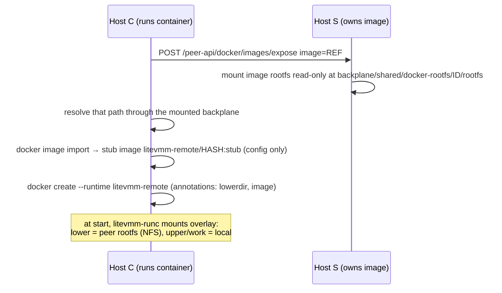

# Docker federation

Docker federation lets every paired Docker host see and run the images of its
peers **without copying image layers**. Docker's own storage is never shared
or modified.

## The catalog

`docker-federationctl catalog-json` merges `docker image ls` from the local
daemon with `GET /docker/images` from each directly paired Docker-capable
peer (through the peer API). Each entry records which host holds it. If one tag
resolves to different image IDs on different hosts, the catalog marks a
**conflict**; LiteVMM refuses to choose silently.

The console's image library and the `docker images` shim both show this
catalog. It is computed on request; nothing is cached or synchronised.

## Zero-copy execution

When a container is created from an image that exists only on peer **S**, on
host **C**:

### Exposing a rootfs (on S)

`docker-rootfsctl expose IMAGE` mounts the image's merged root filesystem
read-only, reusing an existing mount if the image ID is unchanged:

- **`overlay2` storage driver:** an overlay mount with
  `lowerdir=UpperDir:LowerDirs` taken from `docker image inspect`, `ro`.
- **containerd image store:** `ctr images mount` through Docker's embedded
  containerd (`/var/run/docker/containerd/containerd.sock`, namespace `moby`).

Metadata (`image.json`, `image.id`, backend) is written beside it. Docker's
layers are only read, never modified.

### The stub image (on C)

Docker needs an image to create a container. LiteVMM imports an **empty**
image (`docker image import` of an empty tar) carrying the original's
configuration: `ENV`, `WORKDIR`, `USER`, `STOPSIGNAL`, `ENTRYPOINT`, `CMD`,
`EXPOSE`, plus labels `io.litevmm.remote.stub`, `.image` and `.image-id`. It
occupies essentially no space.

### The runtime shim (`litevmm-runc`)

Docker is configured with an extra OCI runtime, `litevmm-remote`, pointing at
`/usr/local/bin/litevmm-runc`. For containers without LiteVMM annotations, it
passes straight through to `runc`. For peer-backed containers, on `create` /
`run` it:

1. Re-runs `prepare-peer` for the image. The peer export is refreshed on every
   container start (event-driven, not polled), so containers recover after the
   source host reboots.
2. Checks that the lower directory is inside the peer storage tree
   (`/var/lib/vmapi/peer-storage/*/shared/docker-rootfs/*/rootfs`) and that the
   OCI rootfs stays inside the bundle.
3. Mounts `overlay lowerdir=PEER_ROOTFS,upperdir=…/upper,workdir=…/work` onto
   the bundle's rootfs, with upper and work under
   `/var/lib/vmapi/remote-container-layers/CONTAINER_ID/`.
4. Hands over to `runc`.

On `delete` only the live overlay mount is removed. The writable layer
persists while the container exists (a stopped container keeps its changes)
and is removed when Docker destroys the container.

### Semantics

- Reads of unchanged files go to the peer over NFS; writes and copy-ups are
  local.
- The container depends on S and the backplane at start and for reads of
  untouched files. A hard NFS mount means those reads **block** while S is
  unreachable.
- `docker pull` is never federated: it means "make a local copy". Explicit
  `--platform`, `--pull` or `--runtime` options keep native behaviour.
- Compose uses Docker natively and pulls images locally.

## The CLI shim

`/usr/local/bin/docker` (installed only if the path is free or already
LiteVMM's) wraps `/usr/bin/docker`:

| Command | Behaviour |
|---|---|
| `docker images`, `docker image ls` | Federated catalog |
| `docker run`, `docker create` | Zero-copy runtime when the image is peer-only |
| everything else | Passed to `/usr/bin/docker` unchanged |

`LITEVMM_DOCKER_NATIVE=true` or calling `/usr/bin/docker` bypasses it. LiteVMM's
own tools always call `/usr/bin/docker`.

## The optional registry

`registryctl` runs `registry:3` as container `litevmm-registry` bound to
`127.0.0.1:5000`, with data in `/var/lib/vmapi/registry`, and publishes
`/v2/` through the web server with its own htpasswd
(`/etc/vmapi-registry.htpasswd`). On lighttpd, request and response bodies are
streamed rather than buffered to disk (important for multi-GB layers).
Generated web configuration is validated, and restored on failure, before
reload.

The registry is independent of federation: it exists for clients that need a
standard Registry v2 endpoint or a real copy of an image.
