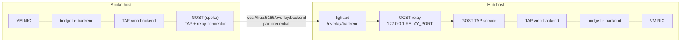

# Overlay networks

An overlay stretches one Ethernet segment across paired hosts. It is built from
three standard pieces: a **Linux bridge** on each host, a **TAP device**
attached to that bridge, and **GOST v3**, which carries the TAP's frames through
a WebSocket on the management port.

## Topology



- **Hub and spokes.** A hub accepts up to 16 spokes; each spoke connects to
  exactly one hub. Traffic between two spokes passes through the hub's GOST.
- **Spokes dial out.** Spokes need no listener, so a spoke can sit behind NAT
  as long as it can reach the hub's management endpoint.
- **Hubs need lighttpd.** The hub publishes `/overlay/NAME` as a generated
  lighttpd route. The nginx (Debian) configuration has no equivalent, so hubs
  must be Alpine hosts.

## What runs

Definitions live in `/etc/vmapi/overlays/NAME.conf` (`SCHEMA=4`, bridge,
role, member peer IDs, MTU, staged flag). The `vmapi-overlay` service
(`overlayctl run`) renders a GOST YAML per overlay into
`/run/vmapi-overlay/NAME.yaml` (`0600`), starts one `gost -C` process per
overlay, and supervises it. A child that exits is restarted; stopping the
service stops the children. Before signalling a PID it checks
`/proc/PID/cmdline`, so a stale pidfile never kills an unrelated process.

**Hub GOST** runs two services:

```yaml
services:
- name: overlay-tap
  addr: "127.0.0.1:TAP_PORT"
  handler: {type: tap}
  listener: {type: tap, metadata: {name: "vmo-NAME", net: "10.77.X.1/24", mtu: 1500}}
- name: overlay-relay
  addr: "127.0.0.1:RELAY_PORT"
  handler: {type: relay, metadata: {bind: true}}
  listener: {type: ws, metadata: {path: "/overlay/NAME"}}
```

**Spoke GOST** runs a TAP service whose traffic is chained through a relay
connector over a `ws`/`wss` dialer to the hub, with `tls.secure: true` (the
hub certificate is verified), a 15-second keepalive, and an
`Authorization: Basic …` header carrying the pair credential.

All GOST listeners are on `127.0.0.1`. Ports are computed per overlay and
reserved so that no two overlays share a bridge or port.

### Authentication

The hub's route is generated per overlay:

```
$HTTP["url"] =~ "^/overlay/NAME$" {
  auth.backend.htpasswd.userfile = "/etc/vmapi-peer.htpasswd"
  auth.require = ( "" => ( "method" => "basic", "require" => "user=relay_A|user=relay_B" ) )
  proxy.server = ( "" => (( "host" => "127.0.0.1", "port" => RELAY_PORT )) )
  proxy.header = ( "upgrade" => "enable" )
}
```

Only the credentials of that overlay's **member** peers may upgrade, and
authentication happens before the WebSocket upgrade. GOST itself needs no
second password. Revoking a peer removes it from the route and closes its open
connections.

### Bridge behaviour

The TAP port has **bridge learning turned off**. GOST tracks remote MAC
addresses itself; if the Linux bridge learned a local guest's MAC from a frame
reflected through the overlay, it would send that guest's unicast replies
(including DHCP ACKs) back into the tunnel. With learning off, the TAP port
floods unknown destinations instead.

If the named bridge does not exist, LiteVMM creates it (`OWN_BRIDGE`), without
members or an address. Attach VM NICs to it (`network=overlay` or
`bridge=BRIDGE`), or add an uplink to extend the segment onto a physical
network.

## Coordinated creation

`POST /api/overlays` on the initiating host:

- **hub:** creates the local hub, then calls `POST /overlays` on each selected
  spoke through the peer API. The spoke creates its endpoint bound to the
  calling peer.
- **spoke:** asks the chosen peer to create a hub for it, then creates the
  local spoke.

Any failure rolls back what was created, including remote endpoints. Deletion
from the initiator removes remote endpoints and reports `remote_cleanup:
"warning"` if one could not be reached.

Route changes on the hub use `vmapi-web-reload`: the new fragment is written,
validated with `lighttpd -tt`, restored on failure, and applied gracefully
after the API response is sent.

## MTU

Frames travel as bytes in a TCP stream, so there is no per-packet
encapsulation overhead and the default MTU is **1500**, matching guest NICs. A
lower overlay MTU makes the bridge run at the smallest port MTU; full-size
guest frames are then dropped without an ICMP error, which breaks routed TCP
while small packets still work. `overlayctl set-mtu NAME MTU` changes an
existing overlay; on a bridge the overlay owns, it moves every port (including
running VM TAPs) and restarts the transport briefly.

## Staged validation

Each overlay has a deterministic health subnet `10.77.X.0/24` (X derived from
the name; hub `.1`, spoke `.2`). A **staged** overlay puts those addresses on
the TAP devices instead of attaching them to the bridge, so connectivity can be
proven in isolation:

1. `overlayctl create … --staged` on both ends;
2. `overlayctl validate NAME` on the spoke: ARP and ICMP to the hub's TAP
   address across the WebSocket;
3. `overlayctl activate NAME` on each end: removes the test addresses and
   attaches the TAP to the bridge.

`GET /api/overlays/NAME/health` reports `peer_reachable` for active overlays.

## Operations

```sh
overlayctl list                 # state: process, TAP, bridge attachment
overlayctl show NAME
overlayctl set-mtu NAME 1500
overlayctl reset                # remove all LiteVMM overlay transports; keeps peers, bridges, workloads
```

Logs: `/var/log/vmapi-overlay.log` (Alpine), and the Overview's service log
viewer (`overlay` source).

## Assumptions and limits

- Hubs are Alpine/lighttpd hosts.
- It is Layer 2 with no encryption of its own. Confidentiality comes from
  `https://` peer endpoints (`wss://`).
- Everything on the segment trusts everything else on it, as on any switch.
  LiteVMM does not firewall or assign addresses on overlays.
- Throughput is one TCP stream per spoke through the web server; broadcast
  heavy or high-bandwidth east-west traffic is better served by a real network.
- TCP-in-TCP: guest TCP over the overlay rides on the tunnel's TCP, which can
  compound retransmission delays on lossy links.
