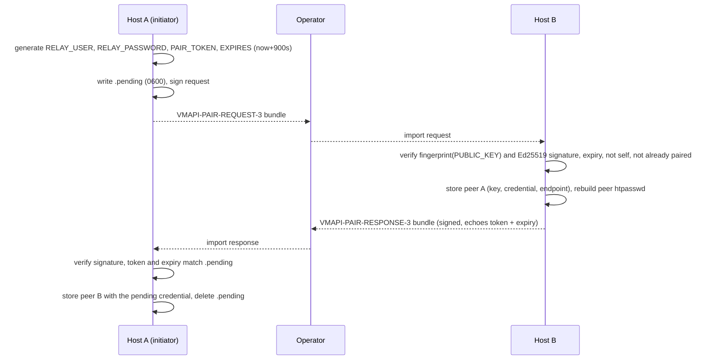

# Peering

Peering is LiteVMM's only trust mechanism. Every multi-host feature is built
on a pair: two hosts that have exchanged signed identities and share one
credential.

## Node identity

On first use `peerctl` creates:

| Item | File | Notes |
|---|---|---|
| Node ID | `/etc/vmapi/node-id` | 16 random bytes as 32 lowercase hex characters, `0600`. Stable for the life of the installation |
| Signing key | `/etc/vmapi/identity/ed25519.pem` | Ed25519 private key (OpenSSL), `0600` |
| Public key | `/etc/vmapi/identity/ed25519.pub` | Fingerprint = SHA-256 of the DER public key |
| Name | hostname (`hostname -s`) | Falls back to `node-XXXXXXXX` if the hostname is not a valid name |

`GET /api/cluster/identity` returns the node ID, name and fingerprint.

## The pairing protocol

Pairing is a manual, out-of-band exchange of two signed, base64-encoded text
bundles. The operator carries them between consoles, which is the step that
authenticates the humans' intent: LiteVMM never trusts a host it discovers on
its own.



### Request bundle (A → B)

```
VMAPI-PAIR-REQUEST-3
NODE_NAME=hv-a
NODE_ID=<32 hex>
PUBLIC_KEY=<base64 PEM>
PUBLIC_FINGERPRINT=<sha256 hex>
RELAY_USER=relay_<32 hex>
RELAY_PASSWORD=<64 hex>
PAIR_TOKEN=<32 hex>
EXPIRES=<unix time>
API_ENDPOINT=https://a.example:5186
SIGNATURE=<base64 Ed25519 signature over the lines above>
```

### Response bundle (B → A)

The same header fields for B, **without** a credential, plus A's `PAIR_TOKEN`
and `EXPIRES` echoed back so the response is bound to that one request.

### Rules enforced

- The signature must verify with the embedded public key, and that key must
  match the embedded fingerprint.
- Requests expire after `VMAPI_PAIR_TTL` (900 s). Requests that claim an
  expiry further than TTL + 60 s in the future are rejected.
- A host cannot pair with itself, and an existing peer must be revoked before
  re-pairing.
- Exporting a request while a valid one is pending returns the **same** bundle,
  so a double click cannot invalidate a bundle already carried to B.
- A relay username may belong to only one peer.
- All pairing mutations take an exclusive `flock` on `/var/lib/vmapi/peers/.lock`.

### What the signatures do and do not give you

The signatures prove that each bundle was produced by the holder of the key
whose fingerprint it contains, and bind the response to the request. They do
**not** prove *which machine* that is: an attacker who can swap bundles in
transit can pair with you under their own key. Confirm the fingerprints (shown
in the import dialog and on the Cluster page) through a channel you trust. The
bundle also carries the credential in clear text, so move bundles over a
private channel and do not leave them lying around.

## The pair credential

Each pair has **one** HTTP Basic credential (`relay_…` and a 256-bit hex
password), generated by the initiator and stored by both hosts in their peer
record:

```
/var/lib/vmapi/peers/NODE_ID.conf    (0600, root)
NAME=hv-b
NODE_ID=…
PUBLIC_KEY_FILE=/var/lib/vmapi/peers/NODE_ID.pub
PUBLIC_FINGERPRINT=…
RELAY_USER=relay_…
RELAY_PASSWORD=…
URL=https://b.example:5186
```

Both directions use the same credential: A calling B, and B calling A, present
`RELAY_USER:RELAY_PASSWORD`. The same credential authenticates the peer API,
the storage backplane WebSocket and overlay WebSockets.

`peerctl sync-auth` regenerates `/etc/vmapi-peer.htpasswd` (APR1 hashes,
`root:lighttpd 0640`) from the peer records after every change. Ed25519 keys
are used only during pairing; ongoing authentication is HTTP Basic, protected
by TLS when the endpoints are `https://`.

## The peer API

`/peer-api/…` is the same router as `/api/…`, reached through a separate
entry point (`peer-api.cgi` sets `VMAPI_PEER_API=true`):

1. The web server authenticates the pair credential against
   `/etc/vmapi-peer.htpasswd`.
2. The router calls `peerctl authorize-user "$REMOTE_USER"`, which re-reads the
   peer records. A revoked peer is rejected even if the htpasswd file were
   stale. `REMOTE_USER` always comes from the web server, never from a
   client-supplied header.
3. Local-administration routes return `403`.

Handlers that need to know **which** peer is calling (overlay creation) map
`REMOTE_USER` back to a node ID with `peerctl peer-id-for-user`.

## The proxy

`peerctl proxy NODE_ID METHOD PATH [CONTENT_TYPE]` performs a peer call with
`curl --fail-with-body`, the pair credential, a 10 s connect timeout and a
1-hour maximum, streaming the request body from stdin. The API exposes it as
`/api/cluster/peers/NODE_ID/proxy?path=…`, which is how the console's remote
view, cross-host inventories, overlay coordination and migration work. Paths
are validated: absolute, no `..`, no CR/LF, and not already prefixed with
`/api` or `/peer-api`.

Peers also get CORS headers for their own recorded origin
(`peerctl cors-origin`), so a console served by host A may call host B's
`/peer-api/` directly if ever needed; unknown origins get none.

## Transport profiles

Other tools derive their connection details from the peer record:

| Command | Returns | Used by |
|---|---|---|
| `peerctl transport-profile ID` | `ws(s)://host:port` + credential | Storage backplane (`websocat`) |
| `peerctl overlay-profile ID` | `ws(s)://host:port/overlay` + credential | Overlays (GOST) |

The scheme follows the peer URL: an `https://` endpoint yields `wss://` with
certificate verification, `http://` yields plain `ws://`.

## Revocation

`peerctl revoke ID`, in this order:

1. `replicationctl revoke-peer`: stops mirrors to that peer and cleans up
   replica-side state **while the credential still works**;
2. `peer-volumectl revoke-peer`: detaches peer-backed Docker volumes;
3. `backplanectl revoke-peer`: unmounts the peer's storage and stops its
   tunnel;
4. deletes the peer record and key, and rebuilds the htpasswd file;
5. `overlayctl revoke-peer`: closes that peer's overlay connections and
   removes it from overlay routes.

Revocation is local. The other host still trusts this one until it is revoked
there too, but its calls now fail with `401`.

## Assumptions

- Each host can reach its peer's **API endpoint** URL as recorded. Pairing
  across NAT needs endpoints that are reachable in both directions.
- Node IDs are unique; they are random, not derived from hardware.
- There is no transitive trust: A↔B and B↔C does not make A trust C.
  Cross-host inventories cover **directly** paired hosts only.
- Clocks are roughly correct (pairing expiry uses Unix time).
