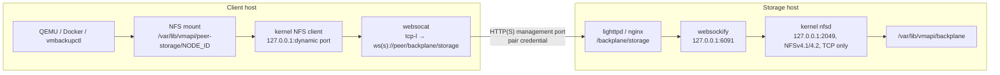

# Storage backplane

The storage backplane is how LiteVMM hosts share files. It is the kernel's
NFSv4 server and client, with the TCP stream carried inside a WebSocket on the
management port. There is no custom filesystem, no userspace storage daemon
and no second network port.

One mount per peer carries everything: backups, VM replicas, peer-backed VM
disks, peer Docker volumes, shared ISO media, zero-copy Docker image rootfs
exports and registry data.

## Data path



## Server side (`vmapi-backplane-server`)

Runs when `VMAPI_BACKPLANE_SERVER=true` (the installer enables it on every
profile). `backplanectl server-daemon`:

1. Loads `nfsd`, mounts `/proc/fs/nfsd`, and bind-mounts `ISO_ROOT` read-only
   at `backplane/shared/isos`.
2. Exports **only** `/var/lib/vmapi/backplane`, **only** to `127.0.0.1`:
   `rw,sync,no_subtree_check,no_root_squash,insecure,crossmnt,fsid=0`.
3. Starts the export helper: `nfsv4.exportd` (Debian), or `rpc.mountd -N 2 -N 3 -u`
   where it is missing (Alpine).
4. Starts `rpc.nfsd` on `127.0.0.1:2049`, NFS **4.1 and 4.2 only**, no UDP, no
   NFSv3 (so no portmapper or lock daemons), with 8 threads.
5. Starts `websockify 127.0.0.1:6091 127.0.0.1:2049`.
6. Verifies the real listeners with `ss`, and every 10 s checks that the helper
   processes are alive. It exits (and is restarted by the supervisor) if not.

The distribution's own NFS service is not used. `GET /api/backplane/status`
reports the verification, including `external_exposure`, which becomes `true`
if NFS or its bridge is listening anywhere other than loopback or if NFS
answers on UDP.

The web server exposes `/backplane/storage` only to users in
`/etc/vmapi-peer.htpasswd`, that is, paired hosts.

## Client side (`vmapi-backplane`)

`backplanectl daemon` reconciles every 10 seconds:

- for each paired host that advertises `storage-backplane` (checked through the
  peer API), ensure it is mounted;
- for mounts whose peer is no longer paired, unmount and forget them.

Connecting to a peer (`backplanectl connect NODE_ID`):

1. Picks a free loopback port in `32000–38999` (remembered in
   `/var/lib/vmapi/backplane-peers/NODE_ID.conf`).
2. Starts `websocat --binary --ping-interval 20 --ping-timeout 60
   tcp-l:127.0.0.1:PORT wss://PEER/backplane/storage`, with the pair credential
   passed in `WEBSOCAT_BASIC_AUTH`, never on the command line.
3. Mounts it:

   ```
   mount -t nfs -o vers=4.2,proto=tcp,port=PORT,nconnect=1,hard,timeo=600,retrans=2,retry=0 \
     127.0.0.1:/ /var/lib/vmapi/peer-storage/NODE_ID
   ```

4. Creates this host's namespace on the peer and chowns it to the local
   `vmapi` UID/GID.

A failed mount stops its tunnel so the next attempt starts clean.

### Retry and back-off

`retry=0` makes each `mount` attempt exactly once. The daemon owns retrying,
with a per-peer back-off of 30 s doubling to 15 minutes, cleared on success.
(The NFS client's own retry loop against an unreachable peer opened enough
connections to exhaust `nf_conntrack` on small hosts.) Explicit operations such
as starting a backup bypass the back-off.

### Hard mounts

The mount is `hard`: if the peer disappears, I/O on the mount **blocks** until
it returns instead of failing. That protects replicas and archives from silent
truncation, but it also means a VM whose disk lives on a peer, or a
peer-backed container, freezes while the peer is down.

## Namespace layout

On the storage host:

```
/var/lib/vmapi/backplane/                0711
├── peers/                               0711
│   └── <CLIENT_NODE_ID>/                0770  owned by the client's vmapi uid/gid
│       ├── backups/<VM>/*.tar.gz
│       ├── replicas/<VM>/disk<N>.qcow2 (+ .meta)
│       ├── vm-disks/
│       ├── docker-volumes/<NAME>/
│       ├── registry/
│       └── artifacts/
└── shared/                              0755
    ├── isos/          read-only bind mount of this host's ISO_ROOT
    └── docker-rootfs/<EXPORT_ID>/rootfs read-only image root filesystems
```

Each client writes under `peers/<its own node ID>/`. `shared/` is published by
the storage host for all its peers.

### UIDs across hosts

NFS here uses `AUTH_SYS`: the server trusts the **numeric** UID/GID sent by the
client. The `vmapi` user usually has a different UID on each host, so the
client stamps its namespace with its own `vmapi` UID/GID after mounting, and
the parent directories are `0711` (traversable, not listable). Unprivileged
QEMU and API processes on the client can then use their namespace.

## Who uses it

| Feature | Path on the peer | Tool |
|---|---|---|
| Peer-targeted backups | `peers/ME/backups/VM/` | `vmbackupctl` |
| Live replication | `peers/ME/replicas/VM/` | `replicationctl` (QEMU writes directly) |
| VM disks on a peer | `peers/ME/vm-disks/` | `vmctl` |
| Peer Docker volumes | `peers/ME/docker-volumes/NAME/` | `peer-volumectl` |
| ISO media on a peer | `shared/isos/` | `vmctl` |
| Zero-copy Docker images | `shared/docker-rootfs/ID/rootfs` | `docker-rootfsctl`, `litevmm-runc` |

`backplanectl path NODE_ID CLASS [NAME]` returns (and creates) a path in this
host's namespace on a peer; `shared-path` resolves `shared/` items.

## Performance characteristics

- One TCP connection per peer (`nconnect=1`), inside one WebSocket, inside
  HTTP(S). Throughput is bounded by a single stream and by the TLS and
  WebSocket proxy CPU cost on both ends. It suits backups, replication and
  modest disk I/O; it is not a SAN.
- `sync` exports favour safety over write latency.
- Idle cost is near zero: a sleeping `websocat` per peer and `nfsd` threads.

## Security properties and assumptions

- **Nothing listens beyond loopback.** A remote party must pass the web server's
  pair-credential check to reach NFS.
- **A paired storage client is trusted with the whole export.** Every tunnel
  arrives at `nfsd` as `127.0.0.1`, and the export is `no_root_squash`, so the
  root user of **any** paired host can read and write everything under
  `/var/lib/vmapi/backplane`, including other peers' namespaces. The per-peer
  directories organise data; they are not an isolation boundary between peers.
  Only pair hosts that you trust with each other's backups and replicas.
- **Local users on the storage host** who can open TCP connections to
  `127.0.0.1:2049` or `:6091` can mount the export too (`insecure` permits
  unprivileged source ports). Storage hosts assume no untrusted local users.
- **Encryption comes from the endpoint.** With `https://` peer URLs, storage
  traffic is inside TLS (`wss://`); with `http://`, NFS traffic crosses the
  network in clear text.
