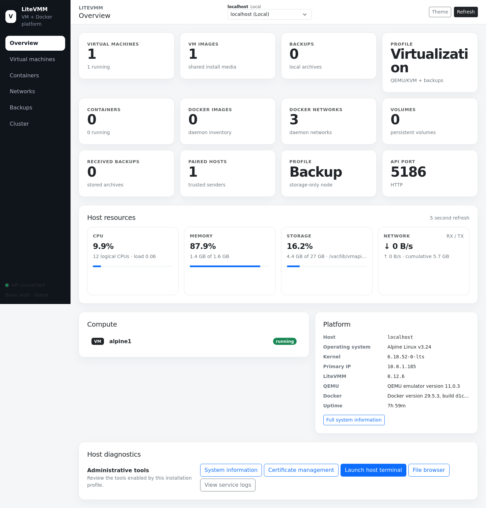
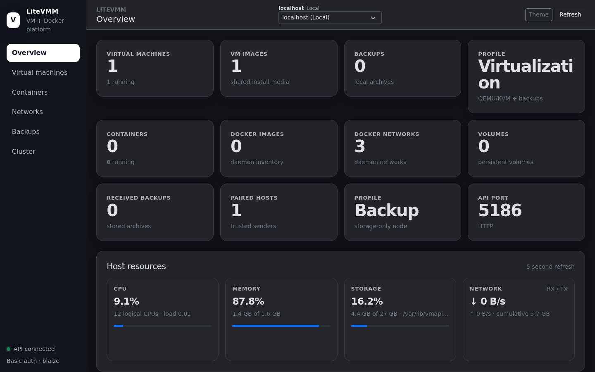
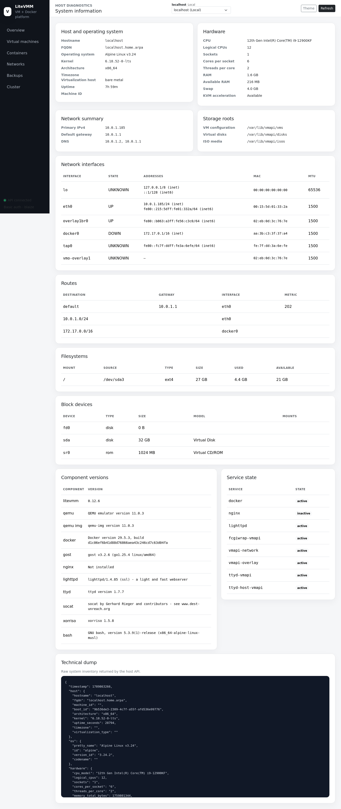
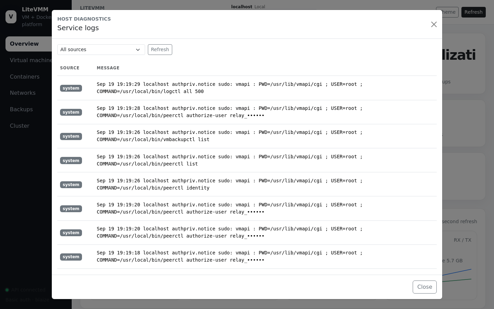
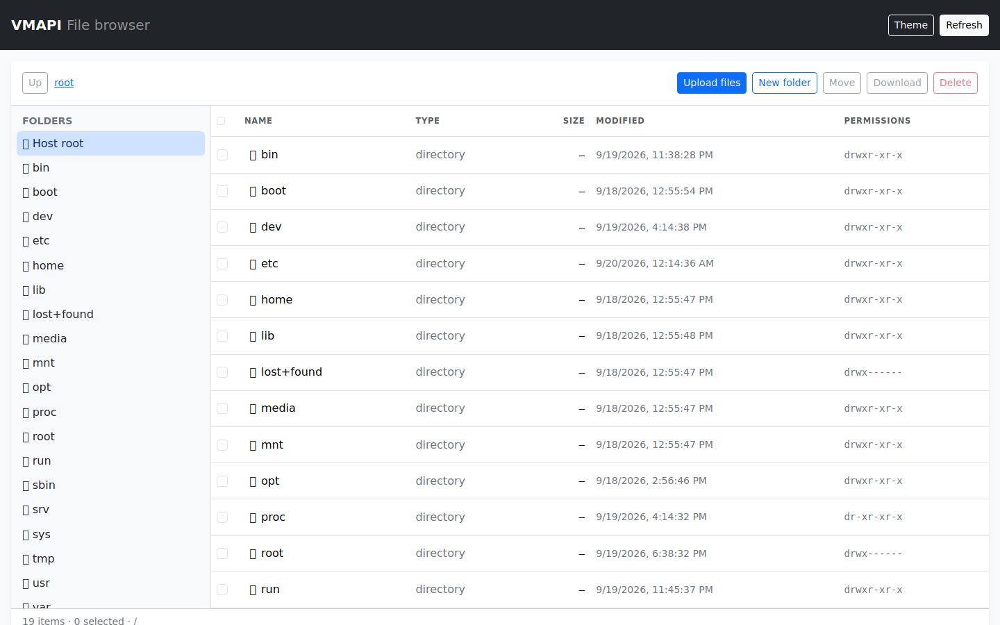
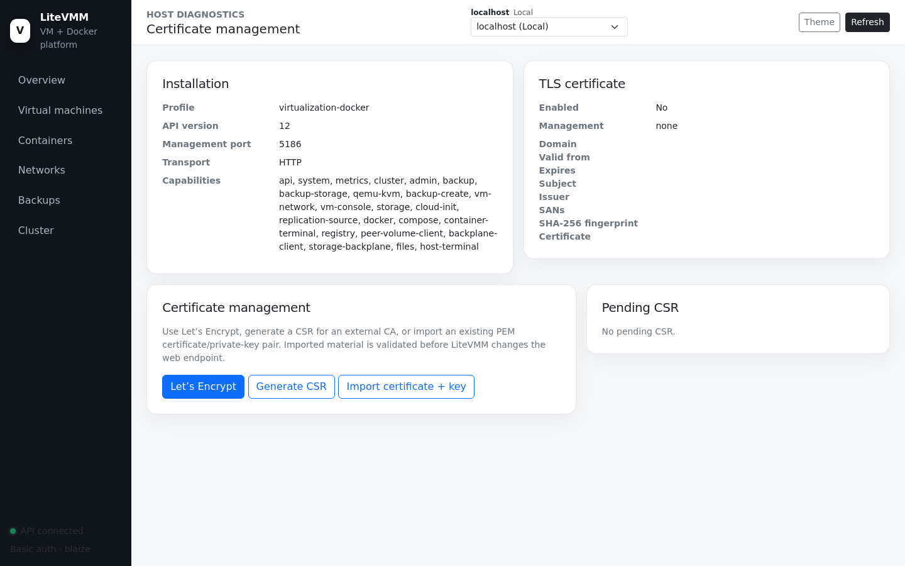

# 2. Console basics

The console is a static single-page application (plain HTML, CSS and
JavaScript with a vendored Bootstrap 5). It needs no Internet access and has no
build step. Every action it performs is an ordinary call to the
[HTTP API](../api/README.md), so anything you can do here you can also script.

## Layout

- **Sidebar**: the main pages. Pages whose feature is not installed on the
  selected host are hidden. For example, *Virtual machines* is absent on a
  `docker`-profile host. See [Profiles and capabilities](08-profiles-and-capabilities.md).
- **Host selector** (top centre): chooses which host the page operates on.
  *localhost (Local)* is the machine serving the console; paired hosts appear
  below it. Choosing a peer turns the page into a remote view of that host.
  See [Operating a remote host](07-cluster.md#operating-a-remote-host).
- **Theme**: toggles light and dark mode (remembered in the browser).
- **Refresh**: reloads the current page's data.
- **Status line** (bottom left): shows *API connected* and the signed-in user.
  It turns red if the API stops answering.

Lists with many row actions collapse them into an **Actions ▾** menu on
narrower screens; the actions are the same.

## Overview

The Overview is the landing page. It refreshes every five seconds while
visible.

| Section | Shows |
|---|---|
| **Host resources** | Live CPU, memory, disk (for the VM storage filesystem) and network throughput, with short rolling graphs kept in the browser only |
| **Compute** | Counts of virtual machines, VM images, containers, Docker images, Docker networks, volumes and backups (whichever apply to the host's profile) |
| **Platform** | Profile, API port and transport (HTTP/HTTPS), and the number of paired hosts |
| **Host diagnostics** | Shortcuts to the tools below |

LiteVMM has no metrics database. Each poll asks the host for a current
snapshot; the browser keeps a short history for the graphs and forgets it when
you leave the page.

## Host diagnostics

### System information

**Full system information** opens a single page describing the host: OS and
kernel, CPU and memory, network interfaces and addresses, routes, filesystems,
block devices, the versions of every component LiteVMM depends on (QEMU,
Docker, GOST, the web server, NFS tools), and the state of every LiteVMM
service. A *Technical dump* at the bottom shows the raw JSON.

This is the first place to look when something is not working: a stopped
service or a missing component usually shows up here.

### Service logs

**View service logs** shows recent log lines from LiteVMM's services (system log, Docker, overlays, the terminal broker and the VM console
broker), filterable by source, newest first. Use it to read the underlying error when an action fails.

### File browser

**File browser** opens in a new tab: a directory tree with a file list, plus
multi-file upload, folder creation, move, recursive delete and ZIP download of
a selection.

The browser starts at `/` and runs with root privileges on the host. An
administrator can confine it to a subtree by setting `VMAPI_FILE_ROOT` for
`filectl`. Deleting or moving the configured root itself is always refused.

> Treat the file browser as a root shell. Anyone who can sign in to the console
> can read and change any file on the host.

### Host terminal

**Launch host terminal** opens a root shell on the host in the browser. It is
served by `ttyd` bound to loopback and reached through the console's own URL
(`/host/terminal/`) using a short-lived session. There is no separate port.

## Certificate management

The **Certificate management** page shows the installation profile, API
version, port and transport, the capabilities this host offers, and the active
TLS certificate (subject, issuer, SANs, validity, SHA-256 fingerprint).

Three ways to enable HTTPS on the management port:

| Button | Use when | What happens |
|---|---|---|
| **Let's Encrypt** | The host has a public DNS name and TCP port 80 is reachable | Certbot obtains a certificate with the HTTP-01 standalone challenge; renewals reuse the same settings |
| **Generate CSR** | An internal or commercial CA issues your certificates | LiteVMM creates a private key (RSA 2048, RSA 4096 or ECDSA P-256) and a CSR. The key never leaves the host. Paste the CA's signed certificate back with **Import signed CSR certificate** (shown while a CSR is pending) |
| **Import certificate + key** | You already have a PEM certificate chain and key | LiteVMM verifies that they match before switching |

A pending CSR never replaces an active certificate. LiteVMM validates the web
server configuration before reloading it, so a bad certificate is rejected
instead of taking the console down. **Disable HTTPS** returns the port to HTTP
and keeps the certificate files.

Key material is stored under `/etc/vmapi/tls`, with private keys at mode `0600`.

> Pair hosts over HTTPS where possible. Peer credentials and storage traffic
> travel over the same management endpoint; see
> [Security model](../technical/security-and-assumptions.md).
