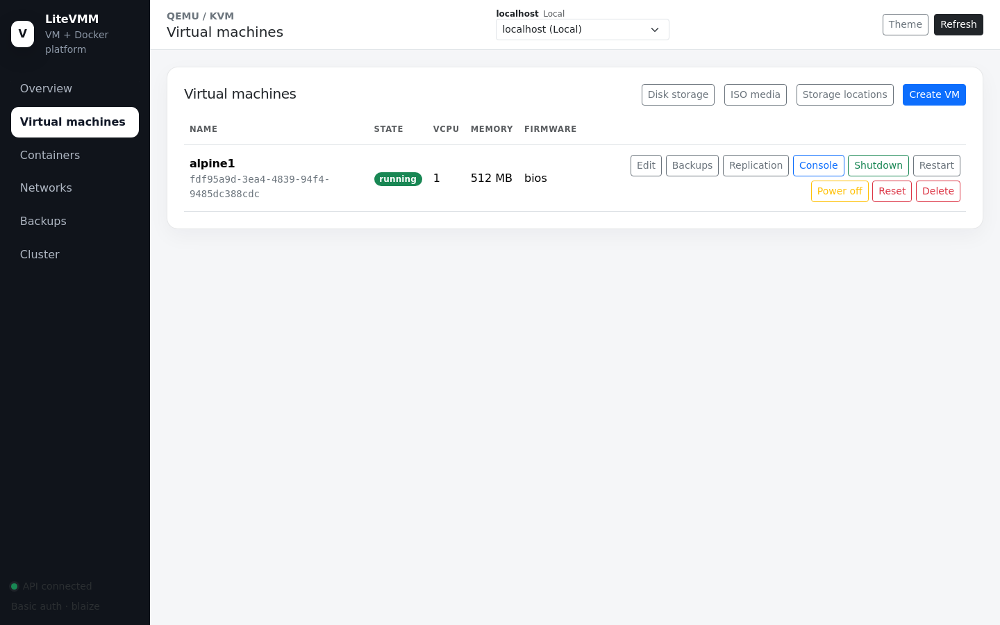
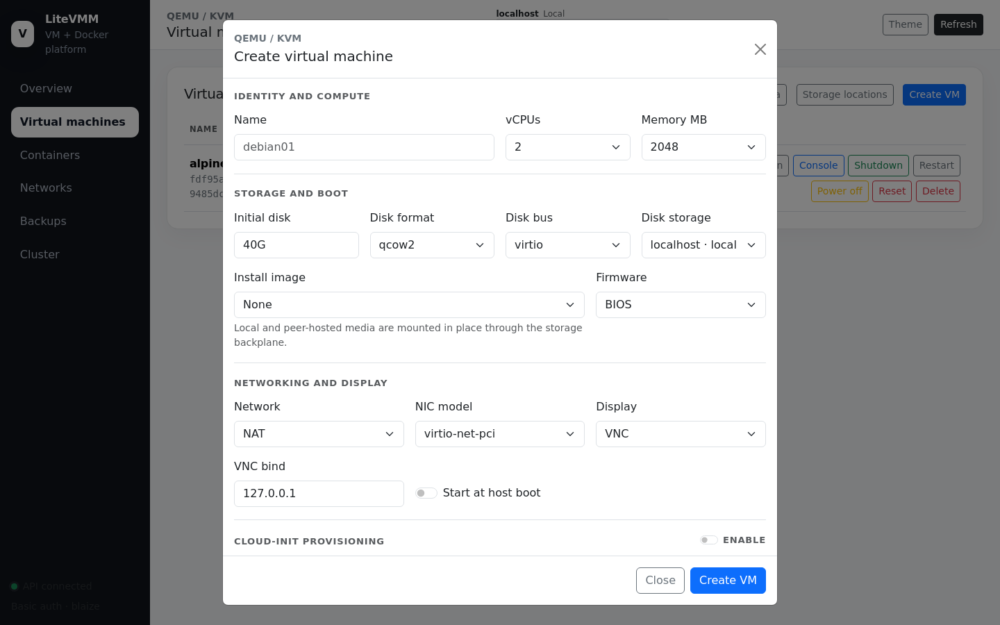
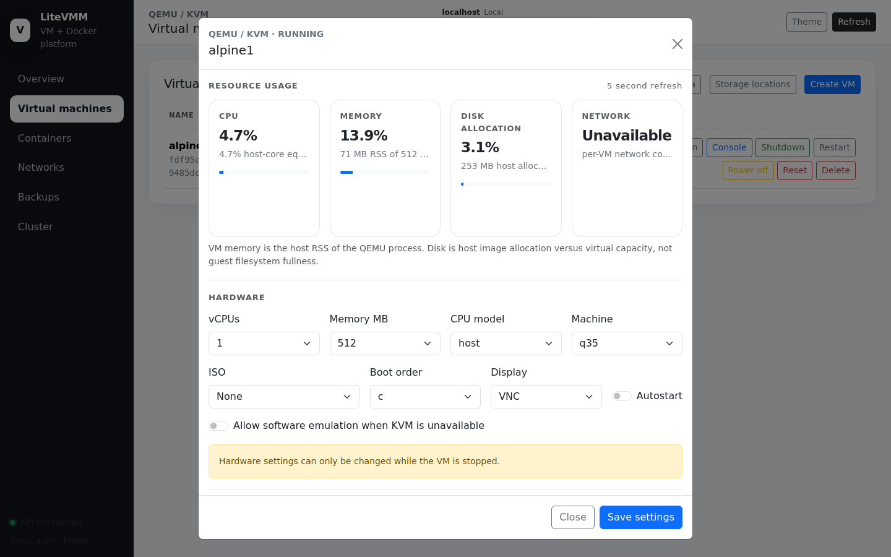
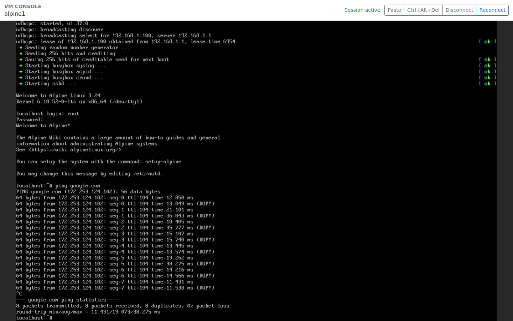
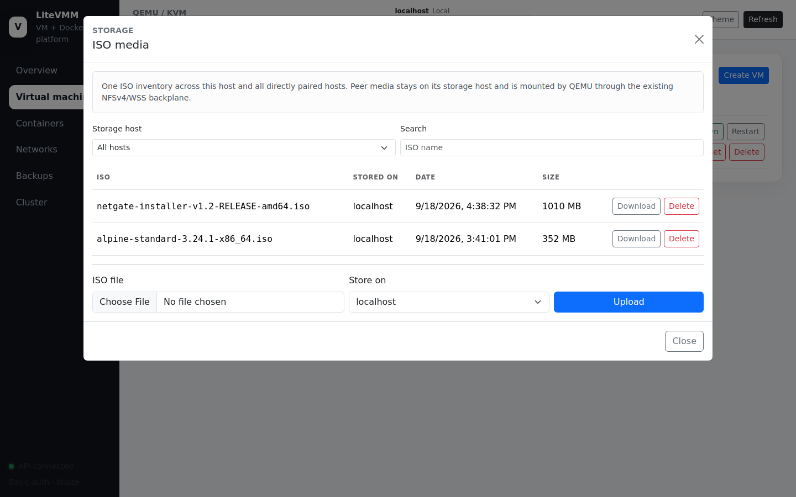
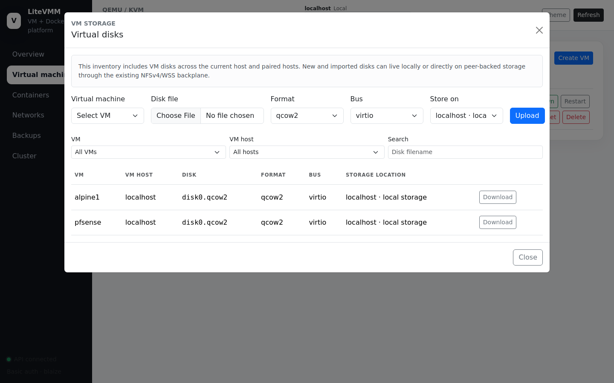
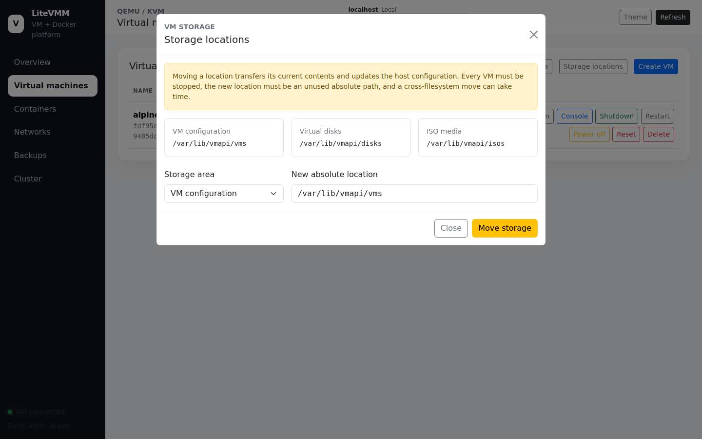

# 3. Virtual machines

Requires a `virtualization` or `virtualization-docker` host.

A LiteVMM VM is a directory, not a database record. Its configuration is a
plain `key=value` file (`/var/lib/vmapi/vms/NAME/vm.conf`), its disks live in
`/var/lib/vmapi/disks/NAME/`, and LiteVMM builds the QEMU command line from
those files every time the VM starts. You can read, back up or copy a VM with
ordinary shell tools.

## The Virtual machines page



The table lists every VM on the selected host with its state, vCPUs, memory
and firmware. The toolbar opens three storage tools and the create dialog:

| Button | Opens |
|---|---|
| **Disk storage** | Inventory of every VM disk on this host and its peers; disk upload/import and download ([below](#virtual-disks)) |
| **ISO media** | Installation media across this host and its peers ([below](#iso-media)) |
| **Storage locations** | Move the VM configuration, disk or ISO root to another path ([below](#storage-locations)) |
| **Create VM** | The create dialog |

### Row actions

| Action | Effect | Available when |
|---|---|---|
| **Edit** | Opens the VM detail dialog (live usage, hardware, disks, NICs, PCI, cloud-init) | Always |
| **Backups** | Opens the Backups page filtered to this VM | Always |
| **Replication** | Starts, inspects or stops live disk replication to a peer | Host has `replication-source` |
| **Console** | Opens the VM's screen in a new browser tab (noVNC) | Running, VNC display, Alpine host |
| **Start** | Boots the VM | Stopped |
| **Shutdown** | Graceful ACPI power-down (QMP `system_powerdown`), waits for the guest to exit | Running |
| **Restart** | Graceful shutdown, then start | Running |
| **Power off** | Immediate stop, like pulling the plug | Running |
| **Reset** | Immediate virtual reset button (QMP `system_reset`) | Running |
| **Migrate** | Moves the VM to a paired host ([Cluster](07-cluster.md#migrating-a-vm)) | Stopped, not replicating |
| **Delete** | Removes the VM and its directories | Stopped |

Graceful shutdown needs working ACPI in the guest. If a guest ignores it, use
**Power off**.

## Creating a VM



The dialog is grouped into sections. A **Create command** panel at the bottom
shows the equivalent `vm-create` shell command as you type, which is handy
for scripting.

**Identity and compute**

| Field | Notes |
|---|---|
| Name | Letters, digits, `.`, `_`, `-`; up to 64 characters; must start with a letter or digit |
| vCPUs / Memory MB | Defaults 2 vCPUs, 2048 MB |

**Storage and boot**

| Field | Values |
|---|---|
| Initial disk | Size such as `40G`; leave empty for no disk |
| Disk format | `qcow2` (thin, supports replication and live backup) or `raw` |
| Disk bus | `virtio` (fastest; needs guest drivers), `sata`, `scsi` |
| Disk storage | **Local**, or a paired **storage-backplane** peer: the disk file then lives on that peer and QEMU reads it over the backplane |
| Install image | An ISO from this host or any peer (see [ISO media](#iso-media)) |
| Firmware | `bios` or `uefi` (UEFI keeps its variables in `nvram.fd` beside `vm.conf`) |

**Networking and display**

| Field | Values |
|---|---|
| Network | `nat` (QEMU user-mode NAT, no host setup needed), `bridge` (attach to a Linux bridge), `overlay` (attach to a LiteVMM overlay's bridge), or `none` |
| Bridge / Overlay network | The target, when that mode is chosen |
| NIC model | `virtio-net-pci` (default), `e1000`, `e1000e`, `rtl8139` |
| VLAN ID | Optional 1–4094. Makes a bridged NIC an access port on that VLAN; the uplink must carry the VLAN |
| Display | `vnc` or `none` (headless) |
| VNC bind | Default `127.0.0.1`. Leave it on loopback; the browser console reaches it through LiteVMM |
| Start at host boot | Autostart when the host boots |

**Cloud-init provisioning** (optional): enable it, set a guest hostname, and
paste user-data (`#cloud-config` YAML or a script starting with `#!`). LiteVMM
builds a NoCloud seed ISO labelled `cidata` and attaches it read-only. The
guest image must already contain cloud-init.

**Advanced options**: machine type (`q35` default, or `pc`), CPU model (`host`
default), boot order (QEMU syntax: `c` disk, `d` CD, e.g. `dc`), a fixed VNC
display number, and **Allow software emulation when KVM is unavailable**.
Software emulation is very slow and is off by default, so a host without KVM
fails loudly instead of running VMs slowly.

## Editing a VM

**Edit** opens the detail dialog.



- **Resource usage** refreshes every five seconds. The figures are host-side
  measurements: QEMU process CPU against the VM's vCPUs, QEMU resident memory
  against configured RAM, and allocated disk bytes against virtual size.
  Without a guest agent LiteVMM cannot see the guest's own free memory or
  filesystem usage, and it does not pretend to.
- **Hardware**: vCPUs, memory, CPU model, machine, ISO, boot order, display,
  autostart and emulation. **Changes require the VM to be stopped.**
- **Cloud-init**: edit hostname and user-data, or disable it. Changing either
  generates a new NoCloud instance ID so the guest re-runs cloud-init on its
  next boot. Saving without changes does not.
- **Disks**: add a new disk or remove one (optionally deleting its file).
  Resize and bus changes apply while stopped.
- **Network adapters**: add NICs (`nat`, `bridge`, `overlay`), change their
  model, bridge, MAC or VLAN, or remove them.
- **PCI passthrough**: attach a host PCI device by address (e.g. `01:00.0`).
  LiteVMM adds `vfio-pci`; you must have set up IOMMU and VFIO binding on the
  host yourself.
- **Console**: **Open noVNC** launches the browser console.

## The browser console



The console opens in a new tab and shows the VM's VNC screen. Each session gets
a short-lived token. A loopback-only GOST forwarder maps the tokenized WebSocket route
to that VM's VNC port, and the web server proxies the exact `/console/ws/TOKEN` path, so
several consoles can be open at once without opening ports. The tab sends a
heartbeat every 30 seconds; stale sessions are cleaned up by `vmapi-console-gc`.

The browser console is available on Alpine (lighttpd) hosts. On Debian, reach
a VM's VNC display through an SSH tunnel to its `127.0.0.1` port (shown by
`vm-console-info NAME`).

## ISO media



One inventory of installation media across this host **and every paired
host**. Upload an `.iso` or `.img` and choose where to store it: locally, or on
a peer. A VM can boot from media stored on a peer: the file stays where it is,
and QEMU reads it through the peer's read-only `shared/isos` export on the
storage backplane. You do not need to copy ISOs to every host.

## Virtual disks



Lists every VM disk on this host and its peers, with format, bus and storage
location. **Upload** imports an existing disk image (`qcow2`, `raw` or `vmdk`)
into a VM, either locally or directly onto peer-backed storage. **Download**
streams a disk file to your browser.

## Storage locations



LiteVMM keeps three storage roots separate so you can place them on different
disks:

| Area | Default | Holds |
|---|---|---|
| VM configuration | `/var/lib/vmapi/vms` | `vm.conf`, NVRAM, cloud-init seeds, runtime sockets |
| Virtual disks | `/var/lib/vmapi/disks` | One directory of disk images per VM |
| ISO media | `/var/lib/vmapi/isos` | Shared installation media |

**Move storage** moves an area's contents to a new, unused absolute path and
updates the host configuration. Every VM must be stopped, and a move across
filesystems copies the data, which can take a while.

## Shell equivalents

Everything above is also available on the host as shell commands. `vmctl` is
the main command, with `vm-*` convenience wrappers:

```sh
vm-create web01 --memory 4096 --cpus 4 --disk 40G --iso alpine.iso --network bridge --bridge br0
vm-start web01
vm-console-info web01
vm-shutdown web01
vm-disk-add web01 --size 100G --bus virtio
vm-nic-add web01 --mode bridge --bridge br0 --vlan 20
cat user-data.yaml | vm-cloud-init-set web01 --hostname web01
vm-command web01        # print the QEMU command line without starting it
```
