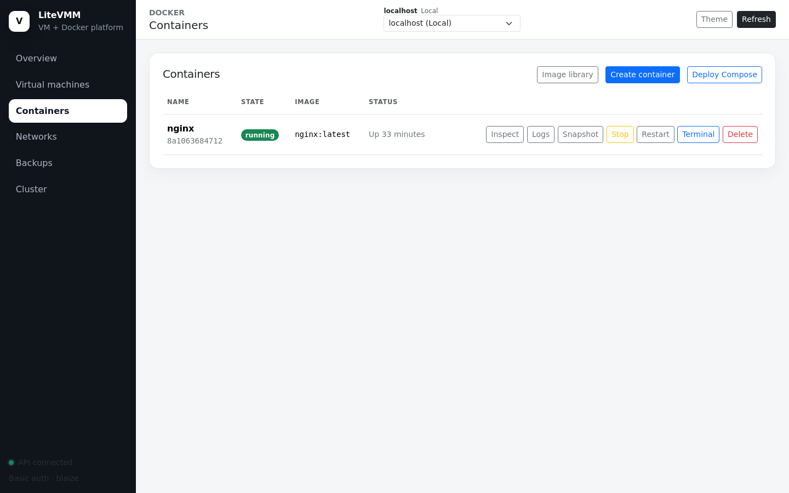
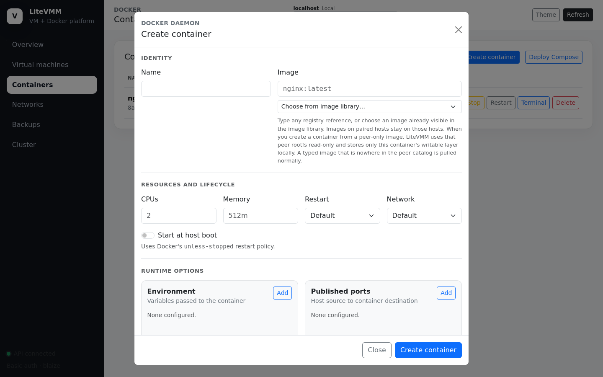
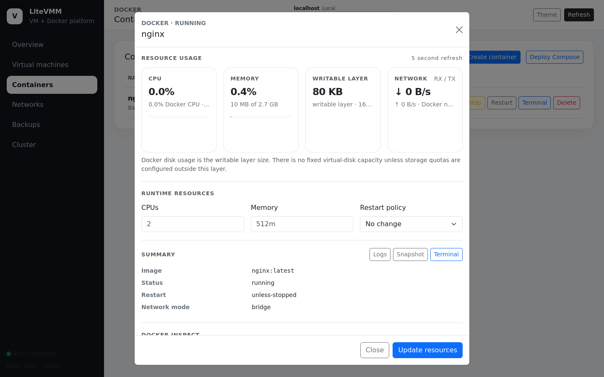
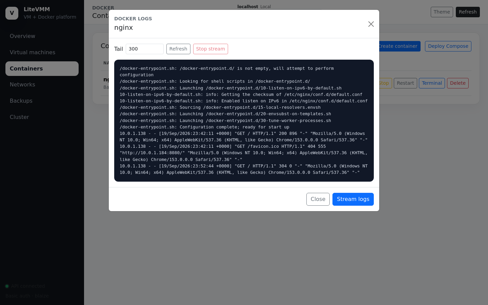
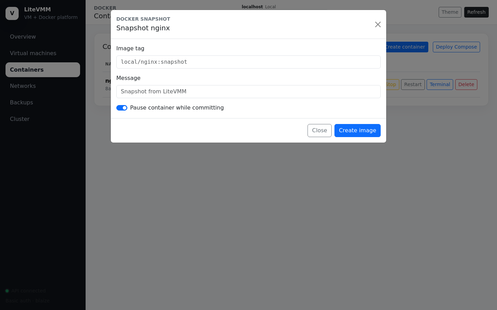
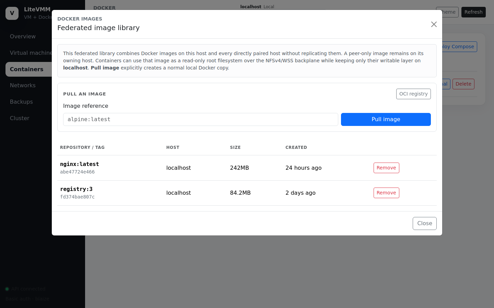
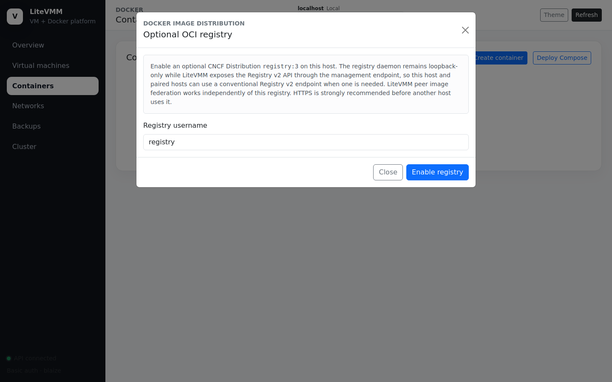
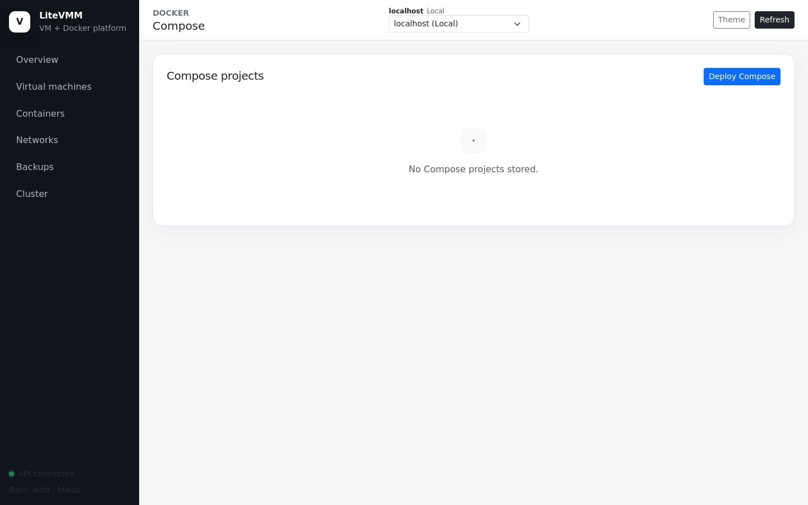
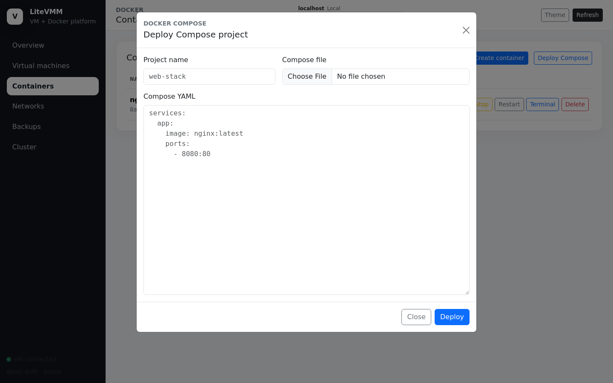

# 4. Containers

Requires a `docker` or `virtualization-docker` host.

LiteVMM does not keep its own container inventory. The Docker daemon remains
the single source of truth for containers, images, networks and volumes;
LiteVMM's pages are a view onto `docker` plus a few additions for multi-host
use.

> **Security note:** access to Docker is equivalent to root on the host. A
> container can mount any host path. Anyone who can use these pages should be
> treated as a host administrator.

## The Containers page



The table shows every container with its state, image and Docker status text.
The toolbar opens the **Image library**, **Create container** and
**Deploy Compose**.

| Row action | Effect |
|---|---|
| **Inspect** | Detail dialog: live usage, resource limits, summary and full `docker inspect` output |
| **Logs** | Log viewer (tail or live stream) |
| **Snapshot** | Commit the container to a new image (`docker container commit`) |
| **Start / Stop / Restart** | Lifecycle |
| **Terminal** | Interactive shell inside the container in the browser |
| **Delete** | Remove the container (optionally with its anonymous volumes) |

## Creating a container



**Identity**: container name and image reference (e.g. `nginx:latest`). The
image may exist locally, on a paired host (see
[federated images](#federated-image-library)), or in a registry.

**Resources and lifecycle**

| Field | Maps to |
|---|---|
| CPUs | `--cpus` (e.g. `2` or `0.5`) |
| Memory | `--memory` (e.g. `512m`, `2g`) |
| Restart | Docker restart policy: `no`, `on-failure`, `always`, `unless-stopped` |
| Network | A Docker network, or empty for the default bridge |
| Start at host boot | Uses the `unless-stopped` restart policy |

**Runtime options**: repeatable lists for **environment variables**,
**published ports** (`host:container[/proto]`), **volumes / bind mounts**,
**labels** and **command arguments** (appended after the image), plus hostname,
user, working directory, entrypoint and a read-only root filesystem.

Each volume entry picks one of three sources:

| Source | What Docker sees |
|---|---|
| **Local host folder** | A bind mount of a host path |
| **Docker named volume** | An ordinary named volume |
| **Paired storage** | A named volume whose data lives on a paired storage host. LiteVMM creates a directory in that peer's backplane namespace and exposes it to Docker as a bind-backed local volume. Docker never talks to NFS itself |

A **Create command** panel shows the equivalent `docker-create` command.

## Container details



Resource usage refreshes every five seconds from Docker's own statistics (CPU,
memory, network and block I/O, PIDs). Disk usage is the size of the writable
layer; containers have no fixed virtual-disk capacity, so LiteVMM reports bytes
rather than an invented percentage.

**Runtime resources** lets you change CPUs, memory and restart policy on a
running container (`docker container update`).

## Logs, snapshots and terminals



**Logs** shows the last *N* lines (default 300). **Stream logs** follows the
log live until you stop the stream or close the dialog.



**Snapshot** commits the container's current filesystem to a new image tag,
optionally pausing it for a consistent copy.

**Terminal** runs `docker exec -it CONTAINER /bin/sh` in the browser. It is
served by a loopback-only `ttyd` behind the console URL
(`/docker/terminal/`), and only a valid short-lived token can start a shell.

## Federated image library



The image library combines the Docker images of **this host and every directly
paired host** into one catalog. The *Host* column shows where each image
physically lives. Nothing is copied to build this list.

When you create a container from an image that exists **only on a peer**,
LiteVMM runs it **zero-copy**:

1. The peer exposes the image's merged root filesystem read-only on its
   storage backplane.
2. This host creates a tiny metadata-only stub image so Docker has the image
   configuration.
3. LiteVMM's `litevmm-remote` OCI runtime overlays the peer's read-only
   rootfs with a **local** writable layer.

Unchanged files are read from the peer; anything the container writes is
stored locally. The trade-off is that the container depends on the peer: the
peer and its backplane must be reachable when the container starts, and when
it reads files it has not modified. If the same tag points to different images
on different hosts, LiteVMM reports a conflict instead of guessing.

**Pull image** always means "store a normal local copy in this host's Docker".
Use it when you want the image independent of the peer.

The same federation applies on the command line. LiteVMM installs a thin
`/usr/local/bin/docker` wrapper: `docker images` shows the federated catalog,
and `docker run` / `docker create` use the remote runtime for peer-only images.
`docker pull` and everything else behave exactly like native Docker; call
`/usr/bin/docker` or set `LITEVMM_DOCKER_NATIVE=true` to bypass the wrapper.

Compose deployments do **not** use the remote runtime; Compose pulls images
locally as usual.

## Optional OCI registry



**OCI registry** (in the image library) enables a CNCF Distribution
`registry:3` container on this host. The registry listens only on
`127.0.0.1:5000`; LiteVMM publishes its Registry v2 API at `/v2/` on the
management port behind its own credential. You can then push local images to
it and point any ordinary Docker client at it:

```sh
docker login 10.0.1.184:5186 -u registry
docker push 10.0.1.184:5186/team/app:1.0
```

The registry is optional. Federation and zero-copy execution work without it.
Use it when software outside LiteVMM needs a normal registry, or when you want a
deliberate copy of an image. Enable HTTPS before other hosts use it; Docker
clients refuse plain-HTTP registries except on `127.0.0.1` unless configured
as insecure.

## Compose projects



The Compose page lists projects deployed through LiteVMM. **Deploy Compose**
takes a project name and either an uploaded `.yaml`/`.yml` file or pasted
YAML.



LiteVMM validates the file with `docker compose config`, stores it at
`/var/lib/vmapi/compose/PROJECT/compose.yaml`, and runs
`docker compose -p PROJECT up -d --remove-orphans`. From the list you can view
the stored YAML, deploy again, bring the project down (`down`) or delete it.

Compose files can do anything Docker can, including host bind mounts, so only
deploy files you trust.

## Shell equivalents

```sh
docker-create web nginx:latest --restart unless-stopped --cpus 2 --memory 1g --publish 8080:80
docker-update web memory 2g
docker-imagectl pull alpine:latest
docker-netctl create appnet --subnet 172.30.0.0/24
docker-volumectl create appdata
```
