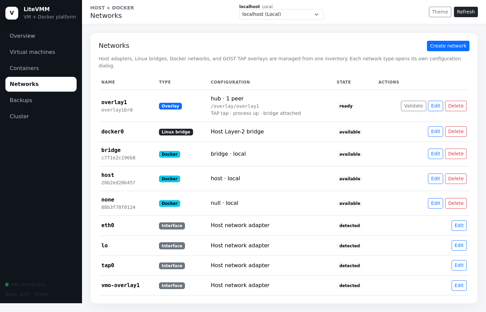
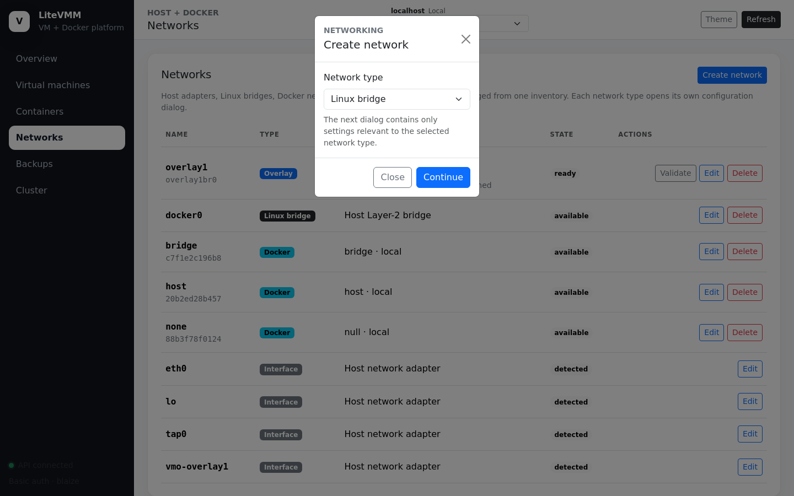
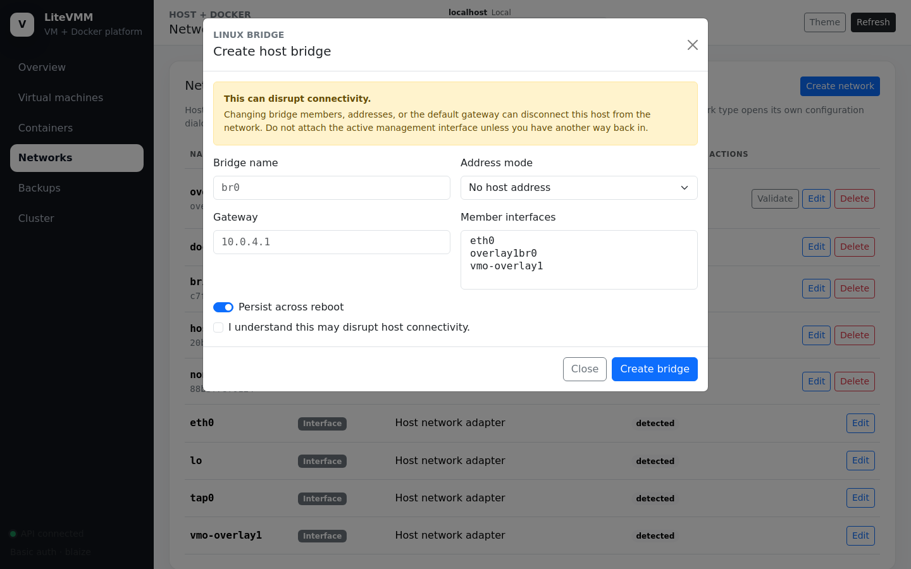
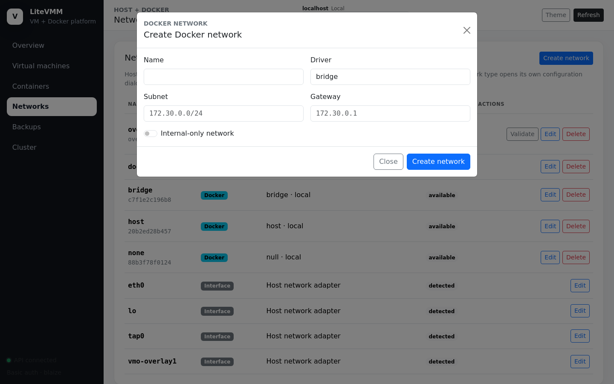
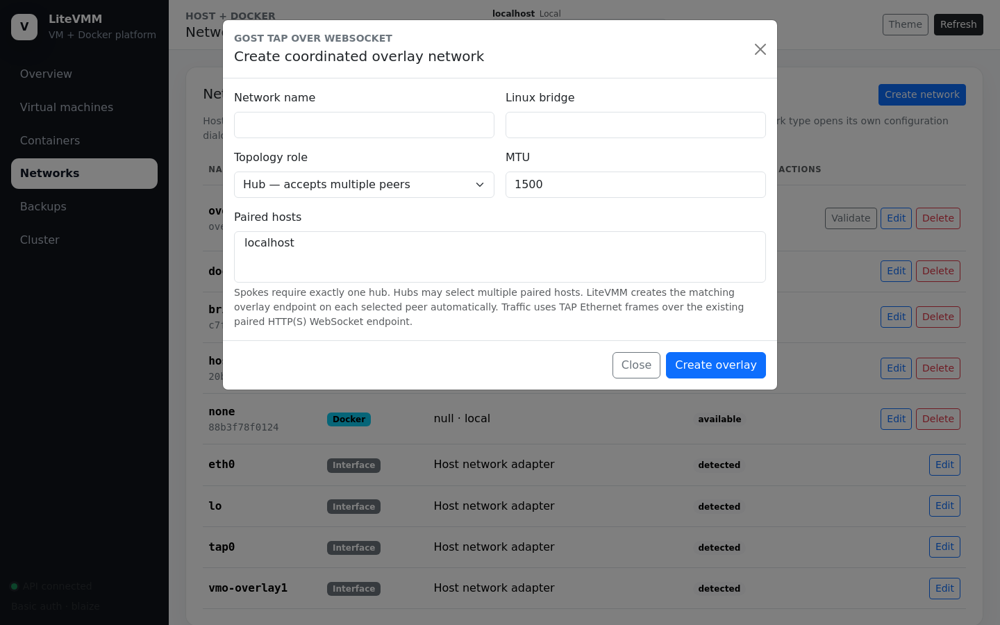

# 5. Networks

Requires a `virtualization` or `virtualization-docker` host (Docker networks
also need Docker).

## The Networks page



One inventory covers four kinds of network, each with its own dialog:

| Type | What it is | Used by |
|---|---|---|
| **Host adapter** | A physical or virtual NIC (read-only here) | Bridge members |
| **Linux bridge** | A kernel software switch, optionally with a host address | Bridged VM NICs, overlays |
| **Docker network** | A network owned by the Docker daemon | Containers |
| **GOST TAP overlay** | A Layer-2 segment stretched between paired hosts over the management endpoint | VMs on different hosts sharing one Ethernet segment |

Row actions are **Edit**, **Delete** and, for overlays, **Validate**.

**Create network** first asks for the type, then opens a dialog with only the
settings for that type.



## Linux bridges



| Field | Notes |
|---|---|
| Bridge name | e.g. `br0` (Linux limit: 15 characters) |
| Address mode | **DHCP**, **static** (address in CIDR form plus optional gateway) or **manual** (no host address; a pure switch for VMs) |
| Member interfaces | Host adapters to enslave to the bridge, typically the uplink NIC |
| Persist across reboot | Saves the definition under `/etc/vmapi/bridges`; the `vmapi-network` service restores it at boot, before VM autostart |

> **This can cut you off.** Moving the NIC you are connected through into a
> bridge, or changing the default gateway, can drop the management connection.
> The dialog requires you to tick an acknowledgement. Have console or
> out-of-band access before bridging the management interface.

VM TAP devices are attached to the bridge at runtime by QEMU. They are not
saved as members and are not listed as selectable adapters.

### VLAN access ports

A bridged VM NIC with a **VLAN ID** (1–4094) becomes an access port: LiteVMM
creates a dedicated TAP, makes the VLAN its untagged/PVID VLAN, and permits
that VLAN on the bridge's uplink ports. The physical switch must trunk the VLAN
to the host.

### Running LiteVMM inside Hyper-V

If the LiteVMM host is itself a Hyper-V VM, the outer Hyper-V switch drops
frames from nested guest MAC addresses unless MAC spoofing is enabled on the
outer VM's adapter:

```powershell
Set-VMNetworkAdapter -VMName "litevmm-host" -MacAddressSpoofing On
```

Without this, nested VMs on a bridge send DHCP requests but never receive
replies.

## Docker networks



Name, driver (`bridge` by default), optional subnet and gateway, and
**Internal-only** (no outbound access). These are ordinary Docker networks;
LiteVMM passes the options straight to `docker network create`.

## GOST TAP overlays

An overlay makes a Linux bridge on one host and a Linux bridge on another
behave like one Ethernet switch. Frames are carried as TAP traffic inside a
WebSocket on the **existing management port**, so no extra firewall ports and
no VPN software are needed. Anything attached to the bridge on either side
(VMs, a router VM such as pfSense, even Docker containers on a macvlan) shares
the segment: DHCP, ARP and broadcasts cross hosts.



| Field | Notes |
|---|---|
| Network name | Lowercase letter first, then lowercase letters, digits or `-`; 11 characters maximum (it becomes part of a TAP interface name) |
| Linux bridge | The local bridge to attach; created automatically if it does not exist |
| Topology role | **hub** or **spoke** |
| MTU | 1200–1500, default **1500** |
| Paired hosts | A hub may select up to 16 spokes; a spoke selects exactly one hub |

Creating an overlay is a coordinated action. LiteVMM creates the local endpoint
**and** the matching endpoint on each selected peer through the peer API.
If any peer fails, everything created so far is rolled back. Deleting the
overlay on the host that created it also removes the peer endpoints.

**Hubs must run on Alpine (lighttpd).** The hub accepts the spokes' WebSocket
connections on `/overlay/NAME`, a route only the lighttpd configuration
provides. Debian hosts can be spokes.

### MTU

Keep the default 1500. GOST carries each Ethernet frame as bytes in a TCP
stream, so there is no encapsulation overhead to reserve. A smaller overlay
MTU is a trap: guests keep sending 1500-byte frames, the oversized ones are
dropped silently, and symptoms look like "ping and DNS work but downloads
stall". To change an existing overlay, run on **every** member host:

```sh
sudo overlayctl set-mtu backend 1500
```

### Validate

**Validate** checks that the peer is reachable through the overlay. For a
staged overlay (created from the shell with `--staged`), temporary addresses
are placed on the TAP devices and an ARP/ICMP probe proves frames cross the
WebSocket before the TAP is attached to the bridge:

```sh
sudo overlayctl create backend --bridge br-backend --role hub --peer SPOKE_ID --staged   # hub
sudo overlayctl create backend --bridge br-backend --role spoke --peer HUB_ID --staged   # spoke
sudo overlayctl validate backend    # on the spoke
sudo overlayctl activate backend    # on each host
```

Overlays created from the console activate immediately.

See [Overlay networks](../technical/overlay-networks.md) for how the transport
works.
