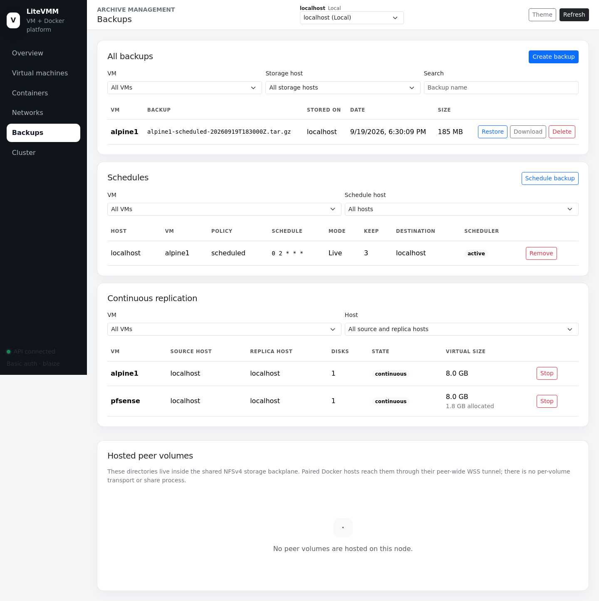
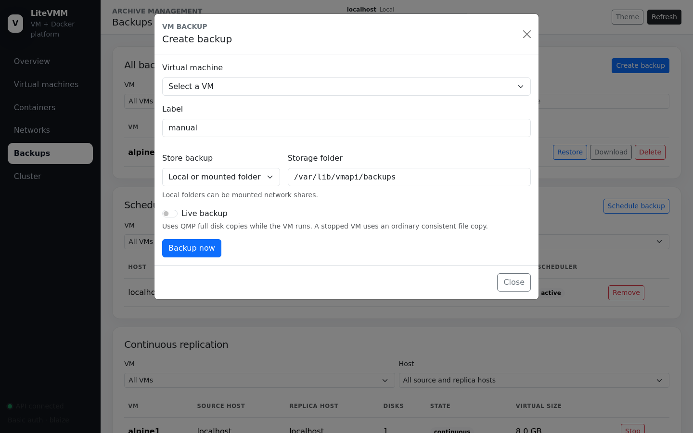
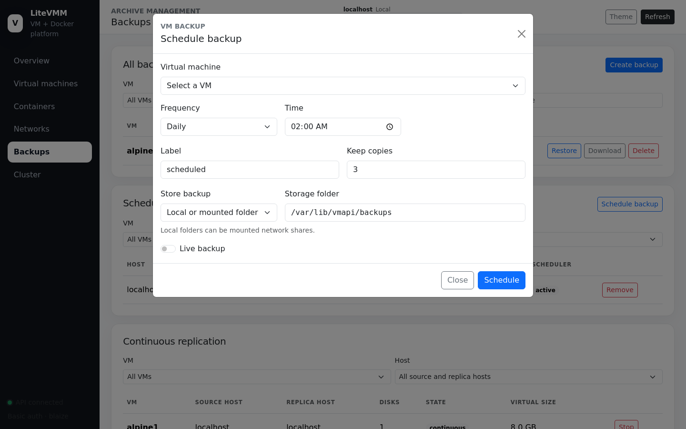
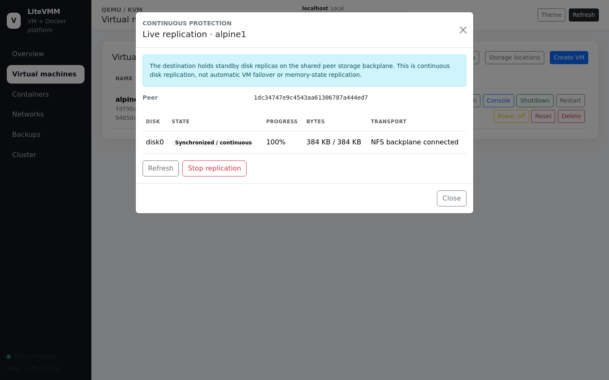

# 6. Backups and replication

LiteVMM protects VMs in two complementary ways:

| | **Backups** | **Live replication** |
|---|---|---|
| What | A point-in-time archive of a VM's configuration and every disk | A continuously updated standby copy of each running VM's disks |
| Where | Locally, a mounted folder, or a paired storage host | A paired storage host |
| Recovery point | The last backup | Seconds behind the source |
| Keeps history | Yes (retention count) | No, only the latest state |
| Use for | Restores, archives, moving VMs | Fast recovery of a lost host |

Neither is high availability. LiteVMM does not replicate guest RAM or CPU
state and never boots a standby VM automatically; recovery is a deliberate
administrator action.

## The Backups page

The page has four panels. Like the storage tools, it shows **this host and
every paired host** together, whichever host is selected.

### All backups

Every archive visible to this host and its peers, with the VM, archive name,
where it is stored, date and size. Filter by VM, storage host or name.

| Action | Effect |
|---|---|
| **Restore** | Restores the archive as that VM on the chosen host. If the VM already exists it must be stopped; its current disks and configuration are replaced **after a rollback copy is taken** |
| **Download** | Streams the `.tar.gz` to your browser |
| **Delete** | Removes the archive |

An archive is an ordinary `tar.gz` holding `vm.conf`, NVRAM, the cloud-init
seed and every attached disk. Runtime sockets are never included. You can
inspect it with `tar -tzf`.

### Creating a backup

| Field | Notes |
|---|---|
| Virtual machine | The VM to back up |
| Label | Tags the archive name, e.g. `web01-manual-20260919T183000Z.tar.gz` |
| Store backup | **Local or mounted folder** (default `/var/lib/vmapi/backups`; a folder can be a mounted network share) or **Authenticated paired host** |
| Destination peer | A paired host that runs the storage backplane |
| Live backup | Back up a **running** VM with QEMU block jobs (QMP) instead of stopping it |

**Backup now** shows progress as it runs. A stopped VM is copied as ordinary
files. With **Live backup**, a running VM is copied with QEMU block-copy jobs
while the guest keeps running. If the VM is also being replicated, replication
pauses its mirror, tracks the guest's writes during the backup, and then
catches up with only the changed blocks.

A backup to a paired host is built locally and then written into that peer's
`backups/` area over the [storage backplane](../technical/storage-backplane.md).
The local staging copy is deleted only after the write succeeds.

### Schedules

**Schedule backup** takes the same destination options plus:

| Field | Notes |
|---|---|
| Frequency | Daily, weekly, monthly or **custom cron** |
| Time / Day of week / Day of month | Build the cron expression for you |
| Cron expression | Standard 5-field cron (e.g. `0 2 * * *`) |
| Keep copies | Retention: after each run, the newest *N* archives of this VM with this label are kept in that destination and older ones are deleted (1–9999) |
| Live backup | As above |

Schedules run from the host's own cron daemon (BusyBox `crond` on Alpine);
there is no LiteVMM scheduler process. The **Scheduler** column shows whether
the cron daemon is active. **Remove** deletes a schedule without touching
existing archives.

> A peer-targeted schedule needs the destination peer to be reachable **and**
> to advertise the storage backplane when the job runs. Check the
> Continuous replication panel or the Cluster page if a scheduled backup
> fails.

### Continuous replication

Lists every replicated VM with its source host, replica host, disk count,
state and size.

| State | Meaning |
|---|---|
| **initial sync** | The first full copy is still running |
| **continuous** | All disks are in sync; each guest write is mirrored as it happens |
| **change tracking** | Replication is paused (for example, during a live backup); writes are tracked and will be copied on resume |
| **disconnected** | The backplane to the replica host is down; replication resumes when it returns |
| **stopped** | The source VM is not running |

**Stop** ends replication and keeps the last synchronised replica files on the
destination until you purge them.

### Hosted peer volumes

Directories that paired Docker hosts store on **this** host's storage
backplane (see [paired storage](04-containers.md#creating-a-container)). They
are ordinary directories under `/var/lib/vmapi/backplane/peers/NODE_ID/docker-volumes/`.

## Setting up live replication

Replication is started per VM from **Virtual machines → Replication**.

1. The VM must be **running**. Replicas are always written as qcow2. Source
   disks may be qcow2 or raw, but only qcow2 sources keep their change
   tracking across a QEMU restart; a raw disk resynchronises in full instead.
2. Choose a destination peer that runs the storage backplane.
3. Optionally cap bandwidth in MiB/s; leave `0` for unlimited.

QEMU performs a full initial copy of each disk into
`peers/SOURCE_NODE_ID/replicas/VM/diskN.qcow2` on the destination, then keeps mirroring
every write. The dialog shows per-disk progress, bytes and transport
(`nfs4-wss-backplane`).

A VM being replicated cannot be migrated; stop replication first.

### Recovering from a replica

If the source host is lost, the replica files on the destination are complete
qcow2 disks as of the last mirrored write. To bring the VM up on the
destination, restore its most recent backup there (for the configuration) and
point its disks at the replica files, or create a VM that uses the replica
disks. LiteVMM deliberately leaves this decision to you: there is no fencing,
so automatic failover could start a second copy of a VM that is still running.

See [Replication and backups internals](../technical/replication-and-backups.md).
