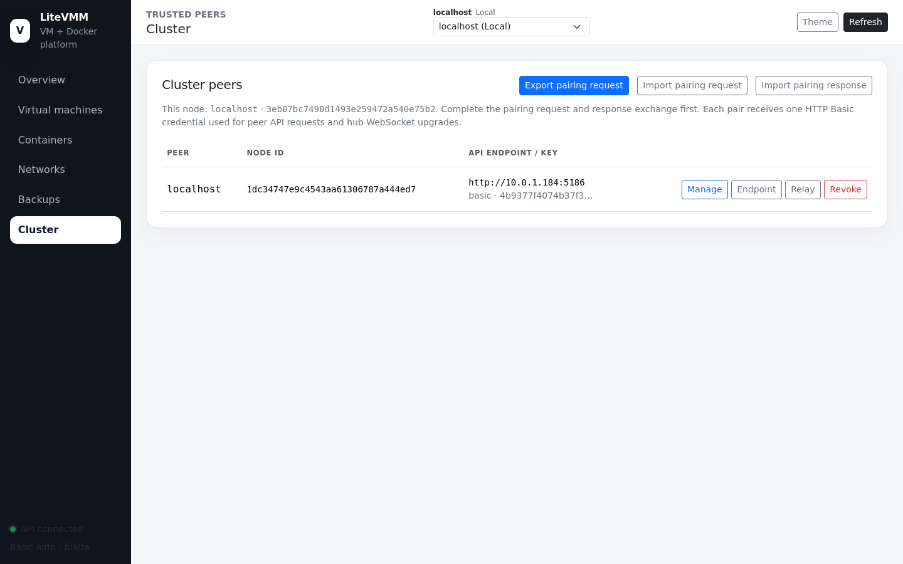
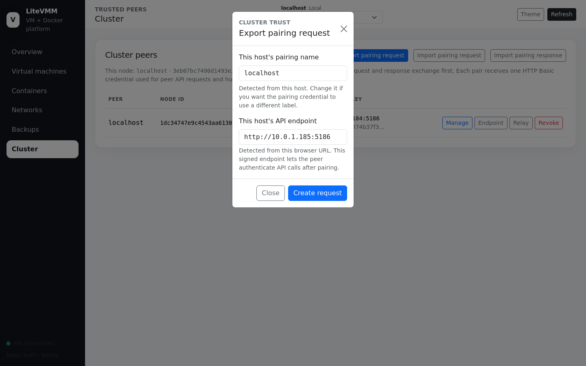
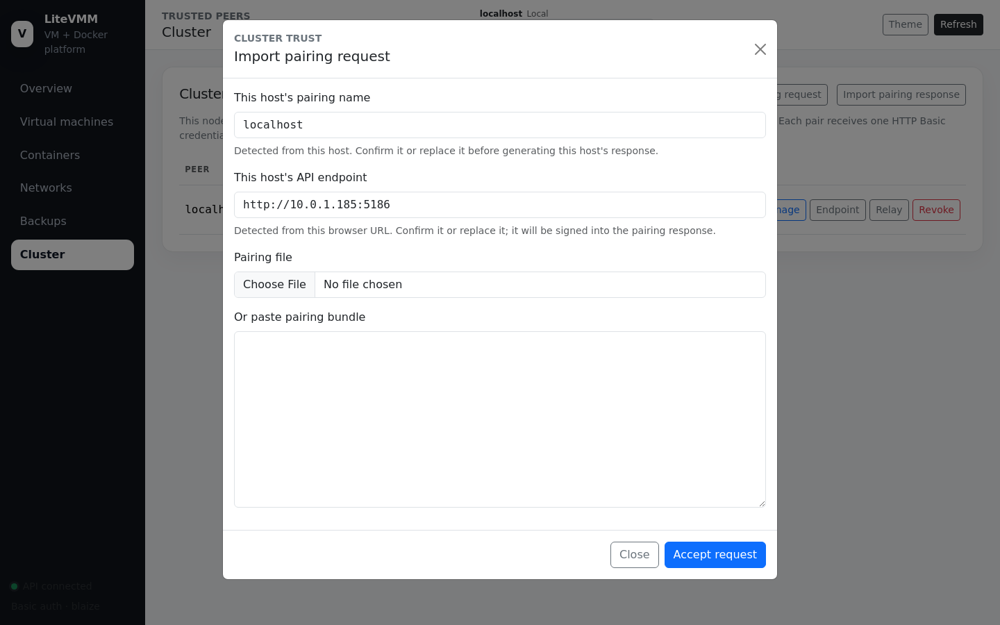
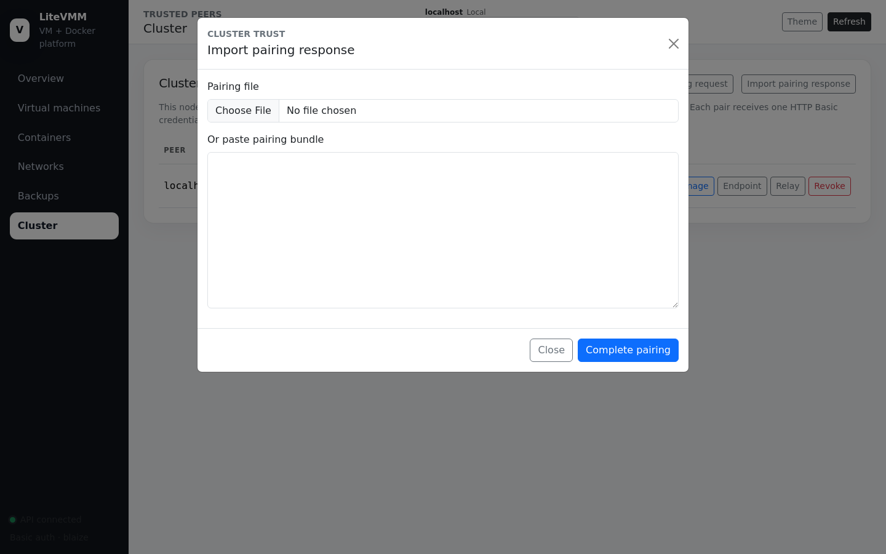
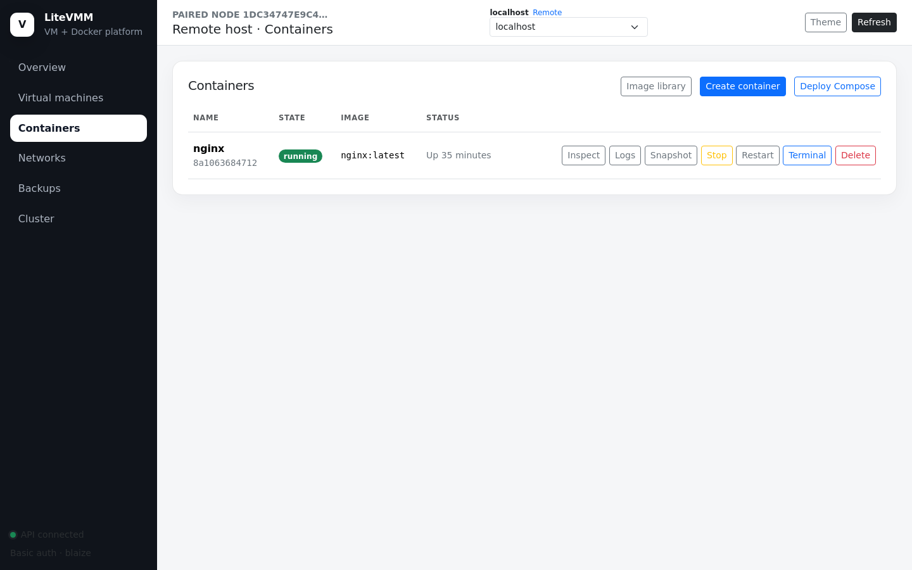

# 7. Cluster and pairing

LiteVMM hosts are linked by **pairing**: an explicit, manual, two-way trust
between exactly two hosts. There is no cluster master, no quorum and no shared
database. A "cluster" is simply the set of pairs you have created, and every
multi-host feature (remote management, backups to a peer, replication, the
storage backplane, federated images, overlays, migration) runs over one pair
at a time.

## The Cluster page

The header shows **this node's** name and node ID. The table lists paired
hosts with their node ID, API endpoint and public-key fingerprint.

| Action | Effect |
|---|---|
| **Manage** | Opens the Overview of that peer through this console ([remote view](#operating-a-remote-host)) |
| **Endpoint** | Changes the URL used to reach the peer (for example after enabling HTTPS or changing its IP) |
| **Relay** | Shows the pair's HTTP Basic credential (treat it as a secret) |
| **Revoke** | Ends the trust ([below](#revoking-a-peer)) |

## Pairing two hosts

Pairing is a three-step exchange of signed bundles. Nothing is sent
automatically: you carry each bundle from one console to the other, so you are
the one who confirms who is on the other end. The steps below call the hosts
**A** (initiator) and **B**.

**1. On host A: Export pairing request**

Confirm A's pairing name and **API endpoint**. The endpoint is the URL that B
will use to reach A (detected from your browser's address; change it if B
reaches A by a different address). **Create request** produces a request
bundle to download or copy. The request is valid for **15 minutes**; exporting
again while it is pending returns the same bundle.

**2. On host B: Import pairing request**

Paste or upload A's bundle. The dialog decodes it and shows A's name, endpoint,
node ID and key fingerprint. **Check these before accepting.** Confirm B's own
name and endpoint (the URL A will use to reach B) and click **Accept request**.
B now trusts A and produces a **response bundle**.

**3. On host A: Import pairing response**

Paste or upload B's response and click **Complete pairing**. Both hosts now
list each other on the Cluster page.

What was exchanged:

- each host's **Ed25519 public key** and node ID, with every bundle signed by
  the sender's private key and checked against its fingerprint;
- each host's **API endpoint**;
- one randomly generated **HTTP Basic credential** for the pair, created by A.
  Both hosts use it for every peer API call, WebSocket upgrade and storage
  connection between them.

See [Peering internals](../technical/peering.md) for the exact protocol.

### Endpoints and HTTPS

Peers talk to each other over the endpoints you enter while pairing. If an
endpoint is `https://`, all peer traffic (API calls, storage, overlays) uses
TLS; if it is `http://`, it does not. Enable HTTPS on both hosts before
pairing them across an untrusted network, or update the endpoint afterwards
with **Endpoint**.

## Operating a remote host

The **host selector** at the top of every page lists this host and its peers.
Selecting a peer (or clicking **Manage**) shows that peer's pages in this
console, with the title prefixed *Remote host* and the eyebrow showing its node
ID.

Requests go to your local host, which forwards them to the peer using the
pair's credential (`/api/cluster/peers/NODE_ID/proxy`). Your browser never
learns the peer's credentials or needs a login on the peer. Pages and buttons
follow the **peer's** capabilities.

The Cluster page itself always shows the local host.

## Migrating a VM

**Migrate** (on a stopped VM) moves it to a paired host:

1. The VM must be stopped and must not be replicating.
2. LiteVMM checks that the destination does not already have a VM of that name.
3. A full archive (configuration and disks) is built locally, streamed to the
   peer's import endpoint and restored there.
4. Only after the peer confirms the import is the local VM deleted. If anything
   fails, the source VM is kept.

This is a cold migration: the VM is offline for the duration of the copy.

## Revoking a peer

**Revoke** on either host:

- stops replication to that peer and cleans up replica-side state;
- detaches peer volumes and unmounts the peer's storage backplane;
- removes the peer's key and credential and rebuilds the web server's
  credential file, so its next request is rejected;
- closes any open overlay WebSocket from that peer immediately.

Revoke on **both** hosts to remove the pair completely. To pair again, run the
three-step exchange from the start.

## Naming hosts

The pairing name defaults to the host's short hostname. If several hosts are
all called `localhost` (a common default), every table shows "localhost" and it
is hard to tell which is which. Give each host a distinct hostname **before**
pairing, or choose a distinct name in the pairing dialog.
